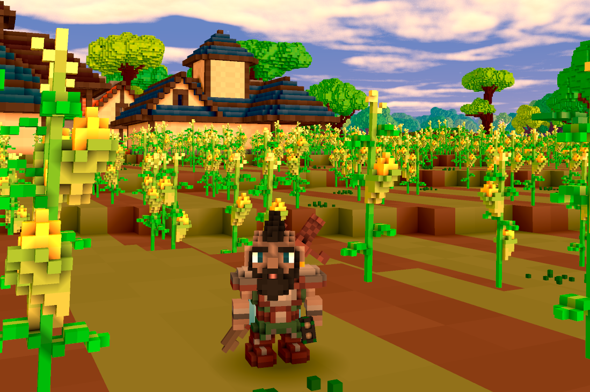
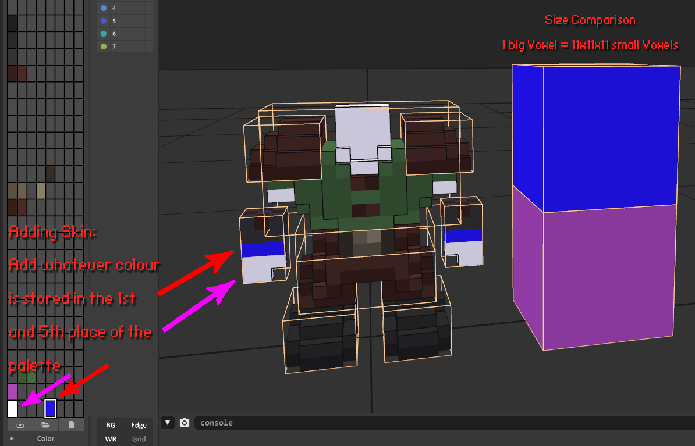
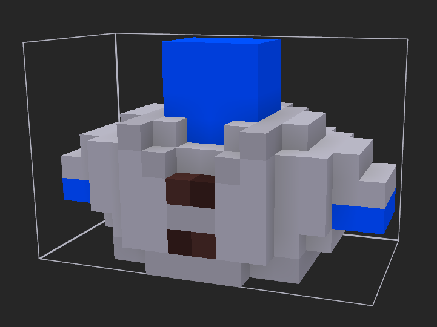
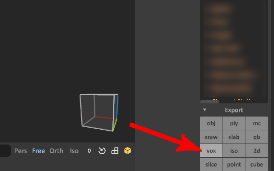
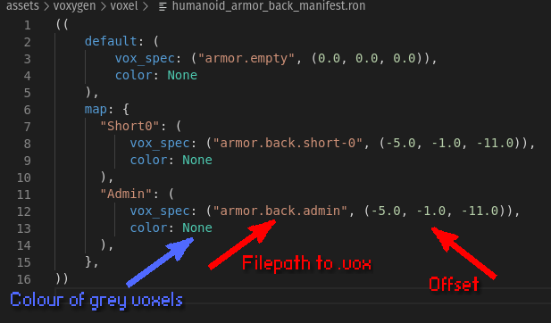
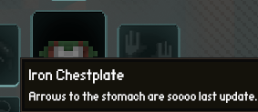
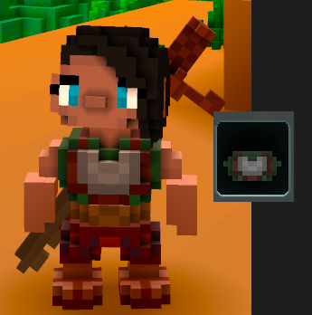

# Guide: Adding armour to Veloren

\\\_ made by @Pfau

\\\_ updated by @BottledByte



## What you need

An **IDE** of your choice (A programme that lets you view and edit code)

Examples: [VSCode](https://code.visualstudio.com/), [Atom](https://atom.io/), [Notepad++](https://notepad-plus-plus.org/downloads/)

A **Voxel Editor** (To create the armour model)

Example: [Magicavoxel](https://ephtracy.github.io/)

The [character template](https://drive.google.com/file/d/1IUp35fsX1gKXEKpC2k_uDcNJ36cHChLI/view). (Can be opened with any voxel-editor that supports layers; i.e. Magicavoxel.)

This is also included in the Veloren client’s assets.

### Getting Started

Before creating your armour in a voxel editor there are a few things you should know:



In order to place “skin” (parts that are not covered by armour) to your work you have to use whatever colour is stored in the 1st (light tone) and 5th (dark tone) slot/index of your palette.

**Note**: _The important thing is not the colour but the **position** on the palette to get the right result._



Armour can be coloured in the code, too.

To do that just use greyscale colours in your model. (Later you will learn how to apply the colours with code.)

Another thing you might notice is the neck added to the chest armour. This is needed to not make the head appear disconnected from the body when it’s turned.

### Importing the model and adding it as an item to the game

To make the game actually load your creation there are several steps you have to follow.

They can be done in any order.

### Copying the .vox into the asset folder

Make sure to **export your model(s) as .vox** and NOT just copy a saved .vox file from magicavoxel. Just copying will result in a ~10x bigger file size.



The file path inside the assets folder is something like

```
assets/voxygen/voxel/armor/<Armor Type>/<Model Name>
```

So for a chest armour called “leather_vest-0.vox” it is:

```
assets/voxygen/voxel/armor/chest/leather_vest-0.vox
```

### Naming scheme for .vox files

Single words are parted with an underscore (“\_”)

Counting starts at zero.

Numbers are added with a single dash(“-”) in front of them.

Your item name should always end with a number, unless you are absolutely positive there isn't going to be an alternative version/design of the item

#### Load the file and store it inside the code

Those are the file paths you will need after opening the root folder of Veloren in your IDE:

```
assets/voxygen/voxel/humanoid_armor_<armour type>_manifest.ron
```

#### ONLY needed for armour with .vox files

(sets the filepath and offsets of the .vox)

```
assets/common/items/armor/<armour type>
```

(create a new .ron in here to create an ingame item)

```
assets\voxygen\item_image_manifest.ron
```

(create a new entry in here to add an item image to the item)

```
common/src/comp/inventory/item/armor.rs
```

**Note:** _ONLY needed for armour with .vox files_

(list your new armour style in here)

### Veloren has 12 types of armour

**Types in bold** need a 3D .vox file

- Head
- Neck (Necklaces)
- Tabard
- **Shoulder**
- **Chest**
- **Hand**
- **Lantern**
- **Belt**
- Ring
- **Back** (Capes, Backpacks...)
- **Legs**
- **Feet**

Armour types that need a 3D .vox file need to be listed in every file above.

### Example for adding a new cape

#### 1. New entry in `assets\voxygen\voxel\humanoid_armor_back_manifest.ron`



**The offset will be determined at a later point!** Just keeping the numbers from the example you copied should be good for now.


Copy this part (make sure to include the brackets and comma!) and paste it:


Fill in the name **of the item style (kind).** This is the name you’ll use to later to match up assets.

Note: `color: None` indicates that grey parts won’t be recoloured.

To colour those parts put in “`color: Some((<R>, <G>, <B>))`” here.

##### Example of recoloured armour

```rust,ignore
"Brown": (
    vox_spec: ("armor.chest.grayscale", (-7.0, -3.5, 2.0)),
    color: Some((90, 49, 43))
),
```

#### 2. New entry in `assets/common/items/armor/<armour type>`


Copy and paste one of the existing .ron files (Note: Use numbers here too).

```rust,ignore
Item(
    name: "New Cape",
    description: "Example Item",
    kind: Armor(
        kind: Back("NewCape"),
        stats: (20),
    ),
)
```

Edit the file to have the right `kind`. (The same kind you put in before.)



`description` field in Item creates a tooltip text similar to this.

#### 3. Add a new item image in `assets\voxygen\item_image_manifest.ron`

You can either use a .png or .vox file as an item image.

Example for a .png:

```rust,ignore
// Lanterns
Lantern("Black0"): Png(
    "element.icons.lantern_black-0",
),
```

Example for a .vox:

```rust,ignore
Armor(Back("Short0")): VoxTrans(
    "voxel.armor.back.short-0",
    (0.0, 0.0, 0.0), (-90.0, 180.0, 0.0), 1.0,
),
```

In order to find the right posing numbers for the .vox it’s often a good idea to look for a similar item.

```rust,ignore
Armor(Back("NewCape")): VoxTrans(
    "voxel.armor.back.new_cape-0",
    (0.0, 0.0, 0.0), (-90.0, 180.0, 0.0), 1.0,
),
```

You can use the same .vox as the actual 3D asset shown equipped on the character later.



#### 4. Finding the right offset for your item

In order to test your item in-game you need to compile your game now.

Your new item will **only be available locally**, so make sure to connect to a local server or choose “Singleplayer”.

To drop the item into your inventory use the chat command `/give_item:`

```
/give_item common.items.armor.back.new_cape
```


When equipping your new item you might be presented with this sight.

To set the right offset you need to revisit `ssets/voxygen/voxel/humanoid/<armour type>_manifest.ron`

The values in there can be hot-reloaded. That means just saving them will immediately take effect ingame.

```rust,ignore
"Admin": (
    vox_spec: ("armor.back.admin", (-5.0, -1.0, -0.0)),
    color: None
),
```

They represent the coordinates:

```rust,ignore
(X, Y, Z)
```

X = Left (lower the number) and Right (increase the number) <br/>
Y = Back (lower the number) and Forth (increase the number) <br/>
Z = Up (increase the number) and Down (lower the number) <br/>

Change the numbers until you get the desired offset.


## Done. You added a new armour style and item to Veloren. :)

### But just in case something went wrong, a little troubleshooting advice

It may happen that your armor displays as a big pink box with a question mark (in the world or in the inventory).

If this happens, some entry is invalid, probably due to a typo in your style
(kind; like "NewCape") or one of the asset paths. See the log for details to pin-point the source.

If the game panics when loading your armor, it mostly means that the syntax
of one or more entries in `.ron` files got garbled (like a missing parenthesis or a quote mark).
