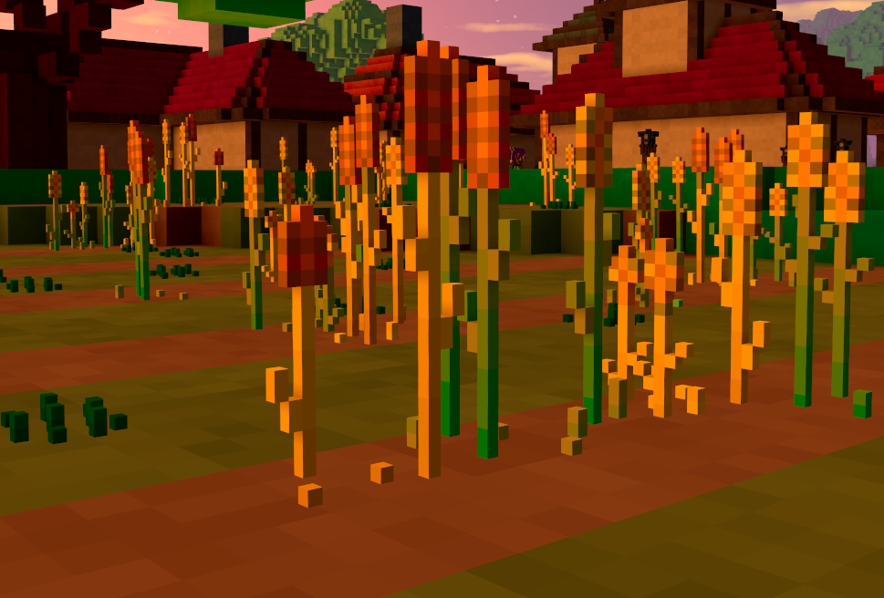

# Guide: Adding sprites to Veloren

\\\_ made by @Pfau



### What you need:

- An **IDE** of your choice (A programme that lets you view and edit code)

  > Examples: [VSC](https://code.visualstudio.com/), [Atom](https://atom.io/), [Notepad++](https://notepad-plus-plus.org/downloads/)

- A **Voxel Editor** (To create the sprite model)

  > Example: [Magicavoxel](https://ephtracy.github.io/)

- A [guide](/contributors/introduction.md) on how to compile and run Veloren on your OS.

- A locally cloned branch of Veloren's [nightly version](https://gitlab.com/veloren/veloren).

### Getting Started

Before creating your sprites there are a few things you should know:

- Sprites act like landscape sized blocks that get replaced with small scale models.<br/>
  They can either be set to behave like air (no collision at all) or as solid objects.

- Things like grass should have no collision. While scarecrows and windows should.

- As of now they will always act like a single row of up to three lanscape blocks (33 small scale voxels) above each others.
  That means you can control the collision height of your sprite but not the width.<br/>
  Every part of a sprite that exceeds the x and y-axis bounds of a single block will not clip with figures and objects.

- Sprites act as immovable objects like blocks. They can't be moved around like figures or objects.<br/>
- Sprites can be set to give players a certain item when picked up.<br/>
- Sprites can have certain spawning and orientation rules.

### Naming scheme for .vox files:

- Single words are parted with an underscore (`_`)
- Counting starts at zero.
- Numbers are added with a single dash(`-`) in front of them.
- Your model name should always end with a number, unless you are absolutely positive there isn't going to be an alternative version/design of the item

### Load the file and store it inside the code

`voxygen/src/scene/terrain.rs`

> Here you define how many variations your sprite can have, how much it sways in the wind and which model(s) to load from the asset folders.

`common/src/terrain/block.rs`

> Here you define the sprites' properties like collision, orientation, the height of their "collision frame" or if they can be collected.

`common/src/comp/inventory/item/mod.rs`

> Sprites listed here will drop items when collected and marked as collectible in block.rs.

`world/src/block/mod.rs` / `world/src/site/dungeon/mod.rs`

> Sprites are part of worldgen and will be treated as blocks with certain spawning rules within 'world':

### Step by Step: Addition of an example sprite

1. In `voxygen/src/scene/terrain.rs` find a `match` that looks like this:

   ```rust,ignore
   match kind {
       BlockKind::Window1 => Some(SpriteConfig {
           variations: 1,
           wind_sway: 0.0,
       }),
   ```

   Copy and paste one of the code-blocks i.e. ...

   ```rust,ignore
   BlockKind::Door => Some(SpriteConfig {
           variations: 1,
           wind_sway: 0.0,
       }),
   ```

   ... and put it behind the last entry.
   Replace the parts inside according the sprite you want to add.

   Much lower you'll find a something called `sprite_models: vec!`.

   Inside it is every sprite type model variation listed. Here you can set the offsets for them, too.

   If you want to center your model (and set the .vox file's workspace to fit your model) it's the negative half of your models dimensions for x and y. The z-axis determines if the model is supposed to sink into the ground.

   _Example:_

   ```rust,ignore
   (
        (BlockKind::Velorite, 0),
        make_models(
            "voxygen.voxel.sprite.velorite.velorite_ore",
            Vec3::new(-5.0, -5.0, -5.0),
            Vec3::one(),
        ),
    ),
   ```

   This loads the first model variant for Velorite. Counting starts at 0.
   The model's Dimensions are 10.0, 10.0, 10.0.
   Using `Vec3::new(-5.0, -5.0, -5.0)`
   will center the model on the block it's spawned. Doing offcentered models is possible but only recommended for non-colliding sprites.
   Putting in `-5.0` will put the sprite model 5 blocks below the ground.
   Most models use `0.0` though to not have any offset at all.

   If there's less variants listed in this `vec` than stated in the `match` above the client might panic.
   So if you put in a "3" above you need at least 3 variants stated as variants "0", "1" and "2" below.

2. In `common\src\terrain\block.rs`

   First add your new BlockKind to the _END_(!) of the `BlockKind` enum directly at the file's beginning.

   Next thing you'll have to do is define whether your sprite behaves like air/clips with figures.
   `pub fn is_air` is the function you're looking for. Add your new BlockKind to the bottom of this `match`and set it to either true or false. Not adding it to this list will make your sprite solid.

   `pub fn is_opaque` and `is_solid` are probably self explanatory and work just like the `is_air`function.

   Next is `pub fn get_height`. In order to be able to define a collision height for your sprites in the next function they need to be solid.

   How do the numbers in there work?

   1.0 are corresponding to 11 small scale voxels.
   So if your model is 18 small scale voxels tall you will need to put in 18/11 = 1.64 in here.

   **Note:** _**3.0** is the maximum height as of now and this collision height will apply to **all** sprite variants of a single type_

3. Next we'll define if your sprite `is_collectible`.

   Only add it to this function if you want to make it collectible. This `match` may also hold Blocks that are meant to be collectible at a later point but are not yet.

   In order for them to actually add an item to the player's inventory they need to be listed in

   `common/src/comp/inventory/item/mod.rs`

   In there you are looking for the `try_reclaim_from_block` function.

   How items are added will be addressed in another guide but adding one of the existing ones for testing purposes is recommended at this point.

### Making sprites spawn in the world

When and how sprites spawn is mostly determined by worldgen code.<br/>
This guide will give a short insight into how this works for things like mushrooms in the open world.

`world/src/block/mod.rs` is the file determining the spawning variables for them.

BlockKinds that are supposed to spawn under certain conditions are stored in arrays:

```rust,ignore
let flowers = [
    BlockKind::BlueFlower,
    BlockKind::PinkFlower,
    BlockKind::PurpleFlower,
    BlockKind::RedFlower,
    BlockKind::WhiteFlower,
    BlockKind::YellowFlower,
    BlockKind::Sunflower,
    BlockKind::Mushroom,
    BlockKind::LeafyPlant,
    BlockKind::Blueberry,
    BlockKind::LingonBerry,
    BlockKind::Fern,
];
```

Further down spawning rules are applied to them.
Details about those might be addressed in another guide about world generation.

Although at this point we can consider this guide..

**Done. You added a new sprite to Veloren. :)**
