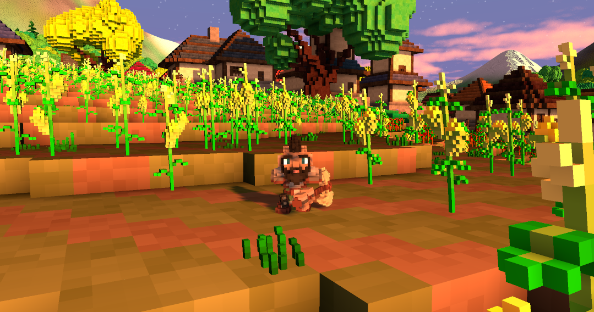

# Guide: Adding Weapons to Veloren

\\_ made by @BOB17368<br>




### What you need:

1. An IDE of your choice (A programme that lets you view and edit code)

    Examples:  [VSC](https://code.visualstudio.com/), [Atom](https://atom.io/), [Notepad++](https://notepad-plus-plus.org/downloads/)

2. A Voxel Editor (To create the weapon model)

    Example:  [Magicavoxel](https://ephtracy.github.io/)

3. A [compiled](/contributors/introduction.md) version of veloren(So you can edit the game's files)


#### Optional:

1. A [character template](https://drive.google.com/file/d/1IUp35fsX1gKXEKpC2k_uDcNJ36cHChLI/view). (Can be opened with any voxel-editor that supports layers; i.e. Magicavoxel.)

2. Access to the veloren [google drive model directory](https://drive.google.com/drive/folders/1jkn8v9I0fo1nJlM29YAI_wWb_V-w456q).


### Some things you might want to know before you start creating your weapon: 

**1.** Veloren has 12 types of weapons:

- Polearms
- Tools
- Shields
- Daggers
- **Sword**
- **Axe**
- **Longbow/Shortbow**
- **Staff**

The non-bolded ones are either a work in progress or have not started their development yet.

**2.** The Veloren google drive files are useful becuase it allows you to use the existing weapon models as format

**3.** You need to have your model(s) approved by the core-devs if you want your model to make it into the actual game

**4.** The handelbar for the weapon has to be at the most, three voxels long and three voxels wide

# Importing the model and adding it as an weapon to the game

To make the game actually load your creation there are several steps you have to follow.

They can be done in any order.


## Step 1: Export and copy the .vox file into the asset folder:

Before you export you models please double check that you have...<br>


1.  Exported your model(s) as **.vox** and NOT just copied a saved .vox file from magicavoxel. Just copying will result in a ~10x bigger file size.


2. Made sure that there is **No** extra space can be shaved of without sacrificing voxels. 


Go to the filepath below and paste your .vox file and rename it according to the naming scheme below.

```
assets/voxygen/voxel/weapons/<Weapon Type>/<Model Name>
```

The filepath to the file should look something like this by the time you finish
```
assets/voxygen/voxel/weapon/sword/long_2h_fine-0.vox
```

#### Naming scheme for .vox files:

 - Single words are parted with an underscore (“\_”)

 - Counting starts at zero.

 - Numbers are added with a single dash(“-”) in front of them.

 - Your weapon name should always end with a number, unless you are absolutely positive there isn't going to be an alternative version/design of the item

## Step 2: Create a .ron file:


#### 1. Create a New Entry in 

```
assets/common/items/weapons/<weapon type>
```


##### Copy and paste one of the existing .ron files of the same type of weapon you aim to create and edit the parts encapsoulated in [ ] to your preference

```rust,ignore
Item(
    name: "[Crude Mallet]",
    description: "[Two-Hand Hammer\n\nPower: 10-12\n\nBreaks bones like sticks and stones.\n\n<Right-Click to use>]",
    kind: Tool(
        (
            kind: Hammer([BasicHammer]),    
            equip_time_millis: 500,
            power: 1.30,
        )
    )
)

```


**Note:** *From now on when I refer to the "Weapon Kind" I am talking about the case-sensitive name you put for "BasicHammer"*


## Step 3: Create a new entry in the weapon manifest file.

#### Go to this file path and open humanoid_main_weapon_manifest in a text editor
`assets/voxygen/voxel/humanoid_main_weapon_manifest.ron`


 Copy and Paste a module of code where the same type of weapons you are adding are grouped (make sure to include the brackets and comma!)

Then adjust `WornIronAxe0` with your "Weapon Kind"


```rust,ignore
Axe(WornIronAxe0): (
        vox_spec: ("weapon.axe.2haxe_worn_iron-0", (-1.5, -3.0, -4.0)),
        color: None
    ),
```


**The offset will be explained at a later point!** <br>Just keeping the numbers from the example you copied should be good for now.


**Optional:** `color: None` is used for giving a weapon a specific tint. Just specify the rgb values by replacing `None` with `Some((<R>, <G>, <B>))`


## 3. Step 4: Adding the armour style to tool.rs

Open `common/src/comp/inventory/item/tool.rs` in a text editor

and add your "Weapon Kind" to the respective enum


```rust,ignore
#[derive(Clone, Copy, Debug, PartialEq, Eq, Hash, Serialize, Deserialize)]
pub enum ShortbowKind {
    BasicShortbow,
    WoodShortbow0,
    WoodShortbow1,
    LeafyShortbow0,
}
```


## Step 5: Add a new item image in image manifest file:

Find where the code for your weapon type is located and copypaste it in the same location


You can either use a .png or .vox file as an item image. But it is only pratical to use a vox model for weapons.


Example for a .vox:

```rust,ignore
Tool(Longbow(WoodLongbow1)): VoxTrans(
        "voxel.weapon.longbow.longbow_wood-1",
        (0.0, 0.0, 0.0), (90.0, 90.0, 0.0), 1.0,
    ),
```

In order to find the right positioning values for the weapon, it’s often a good idea to look for a similar item.

```rust,ignore
Armor(Back(NewCape)): VoxTrans(
    "voxel.armor.back.new_cape-0",
    (0.0, 0.0, 0.0), (-90.0, 180.0, 0.0), 1.0,
),
```

You can use the same .vox as the actual 3D asset shown equipped on the character later.


## Step 6: Finding the right offset for your item:

In order to test your weapon in-game you need to compile your game now.

Your new item will **only be available locally**, so make sure to connect to a local server or choose “Singleplayer”.

Drop the weapon into your inventory by using the following chat command:<br>

Full Command:

```
/give_item common.items.weapons.<weapon type(ex: staff)>.<Weapon Kind>
```

**Tip**: *You can type `/give_item common.items.weapons.` and then press tab to cycle through available weapons*

If you dont like how your character holds your weapon you have to mess with the weapons offsets.

To set the right offset you need to revisit `assets/voxygen/voxel/humanoid_main_weapon_manifest.ron`<br>

And then tweak the offsets marked below until satisfied

```rust,ignore
Sword(LongFine4): (
    vox_spec: ("weapon.sword.long_2h_fine-4", (<x offset>, <y offset>, <z offset>)),
    color: None
),
```
The values in there can be hot-reloaded. That means just saving them will immediately take effect ingame.

They represent the coordinates:

```rust,ignore
(X, Y, Z)
```

X = Left (lower the number) and Right (increase the number) <br/>
Y = Back (lower the number) and Forth (increase the number) <br/>
Z = Up(increase the number) and Down (lower the number) <br/>

Change the numbers until you get the desired offset.


**Done. You added a new weapon style and item to Veloren. :)**
