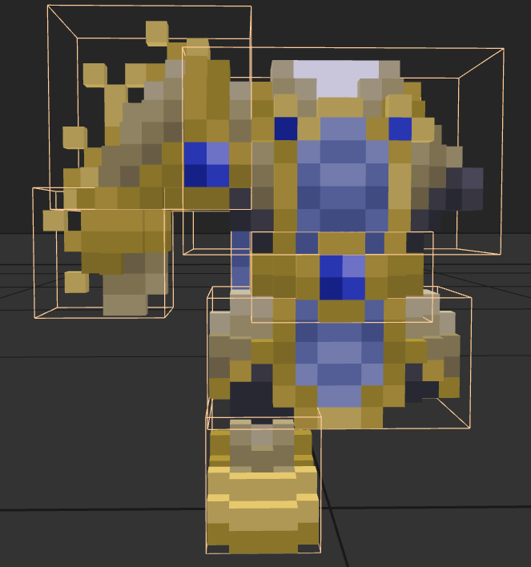
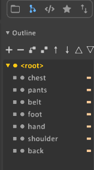
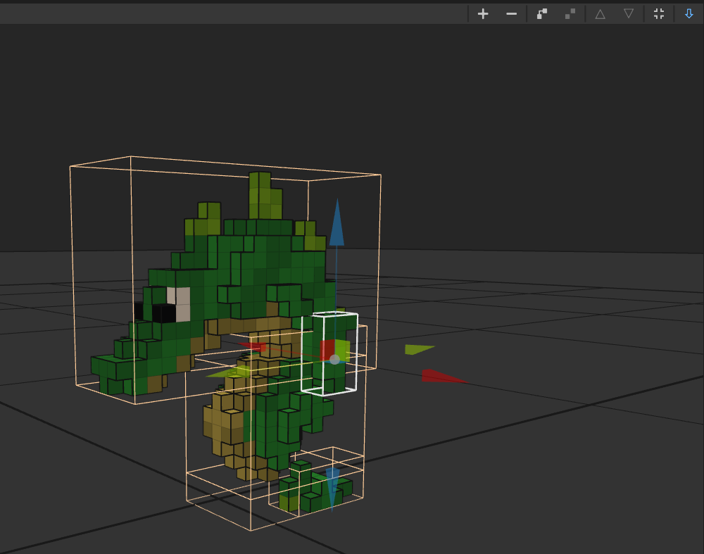
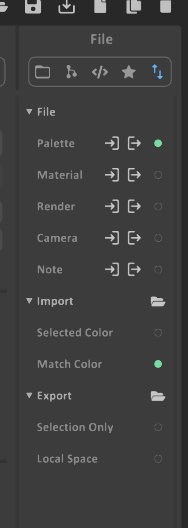

# Guide: Multiple Models in one VOX File

\\\_ made by @Christof

## Introduction

This chapter assumes that you have read the chapter on 
[adding armor](../adding-armor/guide.md) and shows you how to keep all pieces
of one armor set inside a single VOX file. This way it is more easy to see and
edit related models in one Magica Voxel instance.

### Combining models from multiple files

The branch symbol in the outline opens the menu to work on multiple models. 
The plus symbol creates new ones, a double click selects a different one.
Only the active model will be edited, pasted into, etc.

To create a single file from a set of armor files, you can copy models from one 
file and then paste it into another one. One at a time. Remember to first create
a new model entry and select it before pasting into it.

The up/down arrow top right in the main editor (light blue here) switches between world and voxel editing. To 
move models relative to another switch to world mode and pull at the arrows.

To cut down the size of the generated files we sadly can't rely on export, 
but we can turn off most optional parts and save then:

### Selecting the model index

