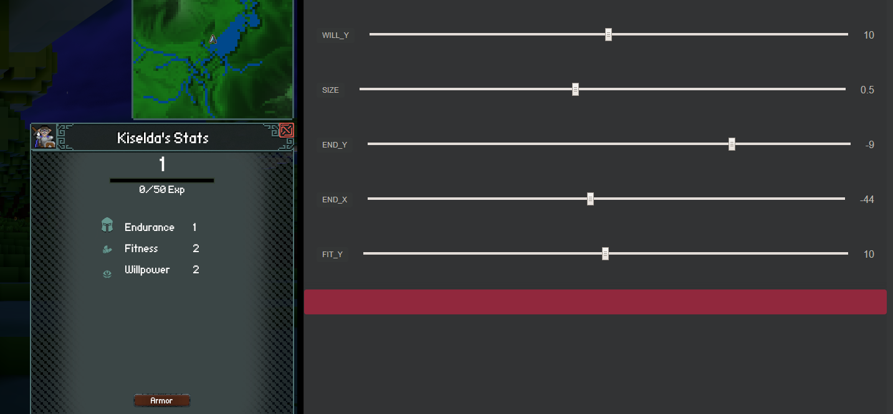

# Guide: Using the const_tweaker crate to modify values at runtime

\\\_ made by @Pfau

### What you can do with it

The [const_tweaker](https://crates.io/crates/const-tweaker) crate allows you to modify constants at runtime.
This can be used to tweak animations, UI widget positions and much more!

### Short guide by example

#### Add a new const to your file:

```rust,ignore
#[const_tweaker::tweak(min = -100.0, max = 20.0, step = 1.0)]
const EXAMPLE: f64 = 10.0;
```

Notice the attached attributes above. Every new const needs their own!<br/>
This will create an f64 type that can be changed between -100.0 and 20.0 in steps of 1.0.<br/>
Adding your changeable value into the code looks like this:

`Foo + *EXAMPLE = Sum`

Notice how it has to be dereferenced in order to work.

`Const_tweaker` is feature gated in Veloren/voxygen. So you need to compile with `cargo run --features tweak`.

**Note**: _go into voxygen folder for this as the compiler won't accept running `--features` from the root directory._

This will create a local web GUI at [127.0.0.1:9938](https://127.0.0.1:9938/) where you can play around with the values.


