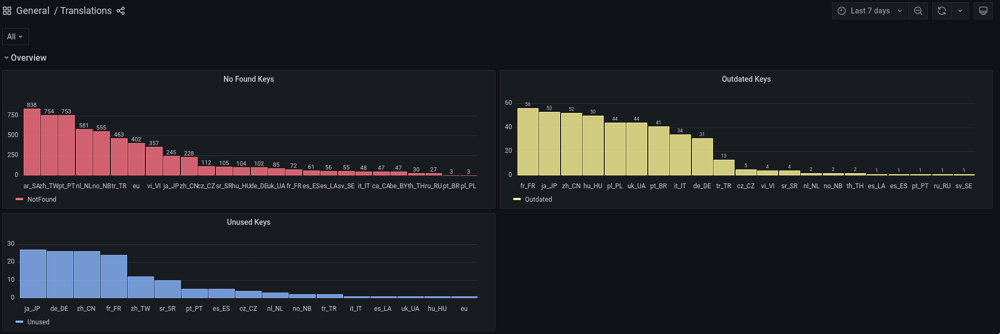

# Translating the game

[](https://translate.codeberg.org/engage/veloren/)

## Preface

Veloren uses the Fluent localization system to translate content.
Translation files have the `.ftl` file extension.
Fluent files contain a list of messages in key-value format.

Fluent messages may or may not have variables inside via syntax of [placeables](https://projectfluent.org/fluent/guide/placeables.html).

```fluent
main-servers-other_error = Server general error: { $raw_error }
main-credits = Credits
```

Fluent messages may have attributes attached to them.

```fluent
common-abilities-hammer-leap = Smash of Doom
    .desc = An AOE attack with knockback. Leaps to position of cursor.
```

Fluent also supports plural selectors via
[Unicode rules](https://www.unicode.org/cldr/cldr-aux/charts/30/supplemental/language_plural_rules.html).

```fluent
hud-trade-buy_price = Buy Price: {$coins ->
  [1] 1 coin
  *[other] { $coins } coins
}
```

Fluent handles language genders as well. You can translate sentences using
the provided gender of actors. Remember to set a default option with the `*`
character for those cases where messages fail to provide the gender.

```fluent
hud-chat-offline_msg = { $user_gender ->
    [she] [{ $name }] вийшла з серверу
    [he] [{ $name }] вийшов з серверу
    *[any] [{ $name }] оффлайн
}
```

You can learn more about Fluent and its syntax here:

<https://projectfluent.org/>

## Using Weblate (recommended)

Weblate is the most convenient way to translate Veloren to your language.

<https://translate.codeberg.org/engage/veloren/>

The game is translated on Weblate with *translation suggestions*. These
suggestions work differently depending on whether or not a language has
any dedicated reviewers.

- The language has one or more dedicated reviewers.
  - You can only add translation suggestions. Reviewers will decide
  whether to accept or reject the suggestions.
- The language has no dedicated reviewers.
  - You can both add and vote for translation suggestions. Suggestions that
  reach a certain number of upvotes get accepted automatically.
- The language does not exist on Weblate.
  - You need to raise an issue on GitLab asking us to add the language to
  Weblate, so that you can start submitting your suggestions there.
  - You can create the issue here:
  <https://gitlab.com/veloren/veloren/-/issues/new>

Dedicated reviewers are trusted members of the community who are committed
to managing translations of their assigned language(s). They decide what
translation strings get into the GitLab repository.

If you would like to become a dedicated reviewer for a language, feel free
to discuss it with us.

## Using programming tools (old way)

Before Weblate was available for contributors, translating the game was
harder because translators needed to make use of the Git version control
system to submit their translations.

Some translation tools complemented those older workflows.
They are still available.

We recommend using Weblate unless you have strong programming skills and
developer experience.

### Previewing your translation

Veloren supports viewing your changes to translation files in real time.
The game must have been compiled with a "debug" build to support this feature.
You can compile the game yourself in this mode by
following the instructions here:

[Compiling Veloren](/contributors/compiling.md)

After you have compiled the game and, effectively, can run a "debug" build of
Veloren, any changes you do to the Fluent files will be reflected in the game
in real time.
These are the files contained inside the `assets/voxygen/i18n` directory.

### Getting information about the translation

Veloren includes a localization test tool if you have compiled the game.

This special tool compares the Fluent keys of your selected language and
compares them with those of the reference language, English.
The tool then classifies and counts these comparisons and prints them in a neat way for translators to inspect.

It is the same program we run in our automated CI pipelines,
but less verbose.

For example, you can run this command to get information about the
Ukrainian translation.

```bash
cargo run --bin i18n-check --features=bin -- uk
```

For more information on how to use this tool, run it with the `--help` argument:

```bash
cargo run --bin i18n-check --features=bin --help
```

### Online localization test

We offer a web service to display translations statistics.

<https://grafana.veloren.net/d/mNjODNM7z/translations>



We will use the Ukrainian translation as our example.


Here we have detailed information about all language keys used in the Ukrainian
translation (`uk` directory) in comparison with the reference language
translation (English - `en/` directory).

The `status` section displayed for each key has the following possible values:

- `Unused`: The key exists in the Ukrainian translation but not in the English
  translation. These are keys that have been used before in the game but
  have been removed since they weren't needed or have been renamed. These
  are safe to remove.
  
- `NotFound`: The key exists in the English translation but doesn't exist in
  the Ukrainian translation. Here we need your translation!

- `Outdated`: Currently not available, means that some changes were made to the
English translation, but not to the Ukrainian translation.

## Troubleshooting

### I cannot make translation suggestions for Veloren on Weblate


If your user account on Codeberg Translate was created before February 2024,
your account might not be granted the required permissions to contribute to
the Veloren translation.

Please, contact the translation team, either on Discord or through an
issue on GitLab.
We will review your permissions and help you resolve the issue.

### Some of the text characters are missing or displayed incorrectly

Please, raise an issue on GitLab to add the missing characters to the game
fonts for your language.
