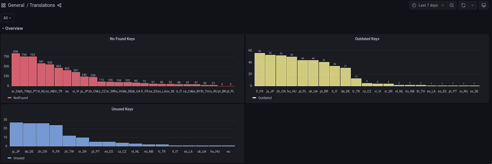

# Translate the Game

### Preparation
There are different ways to contribute translations, but the most straightforward
way is using git and rust. You don't need to compile the game, although debug
builds have useful features like hot-reloading for translations, that allow you
to translate the game while running it.
Tooling to check the status of your translations doesn't require compiling the
full game, but it still requires the Rust toolchain.
Read this [guide on basic tooling](../development-tools.md) (git lfs is important),
[working with git](https://rogerdudler.github.io/git-guide/) (git is not most
user friendly thing, ask if you don't understand something),
[compile instructions](../compiling.md),
and [contribution instructions](../before-you-contribute.md) (most important).

Alternatively, you can just work on directly on [assets](../../players/airshipper.md)
shipped by Airshipper. Beware that updating your game will purge all your work, so
think about using [VELOREN_ASSETS_OVERRIDE](
../../players/env-vars.md#veloren_assets_override)
### File and directory structure explained

You can see the localization files inside the `assets/voxygen/i18n` directory.
Each directory in this directory represents a language (or a variant of it).
The directories are named after [the ISO 639-3 codes](https://en.wikipedia.org/wiki/List_of_ISO_639-1_codes).
(`en/`, `de_DE/`, `pt_BR/` etc.)

Veloren uses a key-value system to translate content. Files use the [Fluent
localization format](https://projectfluent.org) (`.ftl`). Check examples at the
main page and [syntax guide](https://projectfluent.org/fluent/guide/).

They must be formatted in UTF-8, without [BOM](
https://en.wikipedia.org/wiki/Byte_order_mark).
Each language directory contains a `_manifest.ron` file with a metadata section,
font settings that will be used in the game and a `convert_utf8_to_ascii` option,
which can be used when translating a language which has characters that aren't
in the fonts Veloren uses. Don't be afraid to ask for the addition of these
characters to the fonts used by the game via our Discord community

The metadata section includes a display name and an identifier for the
language. The display name may be freely changed but the identifier should
stay the same after the introduction of a new language:

```rust, ignore
metadata: (
    language_name: "English",
    language_identifier: "en",
)
```

> NOTE: language identifier must correspond to the name of language folder,
> which implies that it must correspond to ISO 639-3 standard.

.ftl files contain a list of messages in key-value format.

Fluent messages may or may not have variables inside via syntax of [placeables](
https://projectfluent.org/fluent/guide/placeables.html).
```fluent
main-servers-other_error = Server general error: { $raw_error }
main-credits = Credits
```
Some messages may have multiple attributes attached to them.
Attributes can have various uses, as of the time of writing we use it to create
randomized messsages.
```fluent
loading-tips =
    .a0 = Press '{ $gameinput-togglelantern }' to light your lantern.
    .a1 = Press '{ $gameinput-help }' to see all default keybindings.
    .a2 = You can type /say or /s to only chat with players directly around you.
    .a3 = You can type /region or /r to only chat with players a couple of hundred blocks around you.
```
Fluent also supports plural selectors via
[unicode rules](https://www.unicode.org/cldr/cldr-aux/charts/30/supplemental/language_plural_rules.html).
```fluent
hud-trade-buy_price = Buy Price: {$coins ->
  [1] 1 coin
  *[other] { $coins } coins
}
```

### Localization test explained

Veloren includes a localization test for translated languages. This test
gathers information about every key and compares them with the reference
language (English, `en/` directory). Then it classifies and counts these
comparisons and prints them in a neat way for translators to inspect.
This guide explains where to find the test and how to read the results of it.

We have this fancy [web service](https://grafana.veloren.net/d/mNjODNM7z/translations)
to display translations statistics.

We will use the Ukrainian translation as our example.


Here we have detailed information about all language keys used in the Ukrainian
translation (`uk_UA` directory) in comparison with the reference English
translation (`en` directory). Here is what the `status` section for keys mean:

- `Unused`: The key exists in the Ukrainian translation but not in the English
  translation. These are keys that have been used before in the game but 
  have been removed since they weren't needed or have been renamed. These
  are safe to remove.
  
- `NotFound`: The key exists in the English translation but doesn't exist in
  the Ukrainian translation. Here we need your translation!

- `Outdated`: Currenty not available, means that some changes were made to the
English translation, but not to the Ukrainian translation.

## Guide to translating the game

Guides to help you translate the game, for certain situations. If you get
stuck at any step or need more help (or just have questions) ask us in our
Discord server.

If you are not familiar with Gitlab or Git, feel free to ping `@git-wizard`,
who will always be on deck to help with this.

### Create a translation from scratch

If there is no translation for your language, you can create one by following
these instructions. Remember to replace the Turkish language example with your
own language!

First of all, you need a copy of the Veloren repository. Refer to the
[working with git](../working-with-git.md) section for this.

After you have obtained a copy of the repository, navigate to the `assets/voxygen/i18n`
directory. Here you'll see a list of translations, and the reference English directory
(`en/`).
Make a copy of the `en/` directory, named after your language. For example, if you want
to translate Turkish, your directory would be named `tr_TR/`.

Then, you can start editing the file! First go to the metadata section in `_manifest.ron`.
This section has the display name and the identifier for your translation. Change
`language_name` to a human readable name in your language (eg. `Türkçe (Türkiye)`,
means `Turkish (Turkey)` in English) and change `language_identifier` to the
identifier of your language (usually same with the file name, eg. `tr_TR`).

And that's it! **No code changes required**. You can now start translating any key
you want. Don't forget to preview the changes ingame by [compiling and running
](../compiling.md) the game, and setting the language setting to your new
in-translation language. If there are missing characters, don't worry, you can
ask us about these in our Discord server.

**Tip:** you don't need to compile game to test your changes, you can
just copy your changes to `assets` directory in app folder.
If you have installed the game via Airshipper look in these
[directories](../../players/airshipper.md#files)

**Tip:** You can set `convert_utf8_to_ascii` option to `true` to
convert everything to ASCII, so that the missing characters can be seen properly.

After you are happy with your translation, commit your changes with a proper
commit message, such as `Added Turkish (Turkey) translation`. Create a new
branch with name `<yourusername>/add-<language>`. Then push your changes and
create a merge request (don't forget to read and tick all the boxes!). You can
notify us on the Discord server that there is a new translation available
(in the **#translation** channel).

### Improving an existing translation

If you are lucky, you may already find that there is a translation for your
language. If you see that it has some missing, incorrect translations or
you think that you have a better translation for something, then this guide
is for you! Don't forget to replace the Ukrainian example with your own
language (if you aren't translating the Ukrainian language).

Okay, let's say we want to add the correct translation for the Ukrainian of
`buff-desc-cursed`.
So we first want to look it up in the reference language (English)
`assets/voxygen/i18n/en/buff.ftl`.
After the key we find this English sentence: `Cursed`. We know that
the Ukrainian equivalent would be `Проклін` (Well, some of us do :P).
Then, we open the translated language (Ukrainian)
[`assets/voxygen/i18n/uk_UA/buff.ron`](https://gitlab.com/veloren/veloren/-/blob/master/assets/voxygen/i18n/uk_UA/buff.ron).

**Tip:** Keep both the reference language and the translated langauge open,
so that you can find in which place your entry is missing by looking at the
line numbers.

Once you are editing the file on Gitlab, go to the place where our entry is
missing and add it here:

```fluent
buff-title-cursed = Проклін
buff-desc-cursed = Вас прокляли
```
### Getting information about translation
If you are able to compile, you can use special tool to get information about translation.
Basically, it is the same programm that runs on our CI, but you can cut out unneded
information.
For example, you want to get information about Ukrainian translation.

```
$ cargo run --bin i18n-check --features=bin -- uk_UA
```

You can also run it with `--help` argument to find out more ways to use it.

**Note:** arguments go after `--`, it's where `cargo` arguments end and actual
arguments start.

**Note:** you need to commit your changes for `veloren-i18n` to know about it.

### Push changes
When you're done (or even before you start), create a branch with name
`<yourusername>/update-<language>`. An example would be `juliancoffee/update-uk_UA`.
Then create a commit and give it specific commit message such as `update the
<language> translation`. In our example this would be `update the Ukrainian
translation`.
Finally, you'll need to create a merge request. Note that you need to push your
branch to the developer repository, while making a MR from developer repository
to main one.
Read and check the boxes to agree that your code will be under the GPL3 license.

If you have Contributor role, use /review command in #new-contributors channel.
If you don't have it, ask for it and use /review command.

You now requested to change the files, and we will then take a look at it and if
we found it okay we will merge it into the game! From that point on your
contribution will land in the `master` branch, and in at most a week will be
shipped to players via Airshipper.

### Help review pending translations

Someone may have done a translation for your language already. To check this,
you can take a look at the [Merge Requests](https://gitlab.com/veloren/veloren/-/merge_requests) page.
See if you can find a pending merge request with your language (e.g. `de_DE`).
Ask in our Discord server for reporter privileges so you can open it and add
your thoughts / reviews to it.

If you found one, clicking on the `Changes` tab when you're in the MR page you
can see the details of this change. Red lines are old ones that are removed
and replaced by green lines. If you disagree with something that was added,
you can start a discussion by clicking on the respective line. If you don't
see any issues with the proposed changes, feel free to approve the MR or
comment on it. It's important that you approve the MR for translations as we
the developers don't have the knowledge to verify the language (and we don't
want to put everything through Google Translate). So you help us to verify
others contributions resulting in improved game quality.

