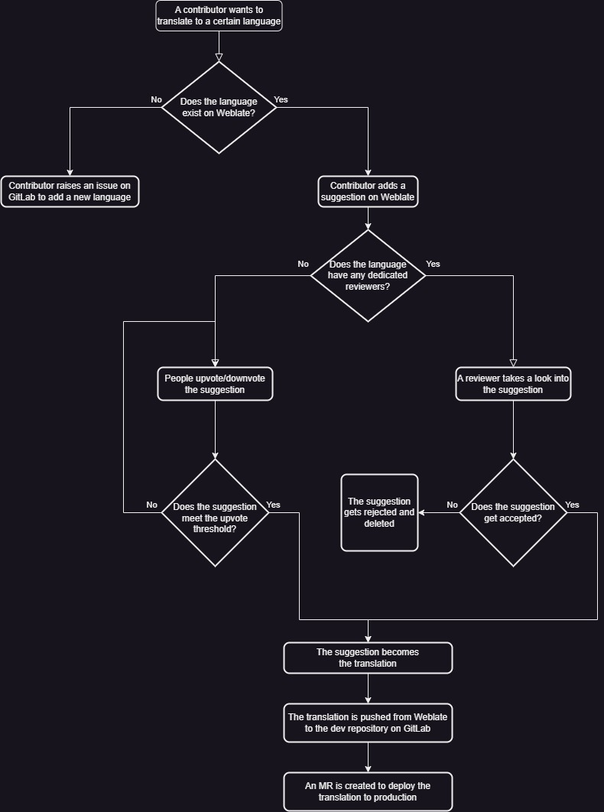

# Managing Weblate

## Translation workflow



## Language types

Languages are classified into two types:

1. Languages with one or more dedicated reviewers.
    - Contributors can only add translation suggestions.
    - Reviewers are responsible for checking suggestions and deciding
    whether to accept or reject them.
2. Languages without any dedicated reviewers.
    - This is the default type.
    - Contributors can both add and vote for translation suggestions.
    - A suggestion becomes the new translation once it reaches a certain number
     of upvotes.

## Language configuration

### Set the language type

Our project on Weblate assumes by default no language has any dedicated
reviewers. Only languages with one or more reviewers are configured
explicitly by administrators.

Let's imagine the following scenario:

1. The **Turkish** language does not have any dedicated reviewers on Weblate.
2. A member of our community, Mary, requests to be a reviewer for the Turkish
translation of Veloren.
3. The **Turkish** language must change from the default, implicit, behavior
to a new, explicit, behavior. A behavior for languages with dedicated
reviewers.

As an administrator of our Weblate project, you would need to follow
these steps:

1. Go to the language settings for Turskish on Weblate.
    - The URL in this context would be:
    <https://translate.codeberg.org/settings/veloren/-/tr/>
2. Make sure only these checkboxes are enabled:
    - Customize translation workflow for this language
    - Turn on suggestions
3. Add Mary's user on Weblate to the **Reviewers: Turkish** project team.
    - The URL in this context would be:
    <https://translate.codeberg.org/teams/487/>

The difference now, with respect to default behavior, is that Turkish has
`Suggestion voting` disabled. Thus, reviewers, such as Mary, are the only
people capable of managing the translation: what strings make it into the
GitLab repository.

If you want to get the default behavior back for a language (no reviewers), follow these steps:

1. Remove every user from the corresponding reviewer team.
2. Go to the language settings and disable the **Customize translation
workflow for this language** checkbox.

### Adding a language to Weblate

We may get requests from time to time to add languages on Weblate for
which there are no translations of the game yet. Administrators of our Weblate
project are responsible for attending such requests.

A local installation of Git is required to add new languages to Weblate.

#### Cheatsheet

If you need to add a language quickly, follow these steps:

1. Make sure you have a local copy of the Veloren repository on your device.

    ```bash
    git clone https://gitlab.com/veloren/dev/veloren.git
    ```

2. Create a new branch.
    ```bash
    cd veloren
    git checkout -b <yourusername>/add-<language>
    ```

3. Head to the `assets/voxygen/i18n` directory.

    ```bash
    cd assets/voxygen/i18n
    ```

4. Make a copy of the `en/` directory, named after your language.
For example, if you want to translate to Turkish,
your directory would be named `tr/`:

    ```bash
    cp en <ietf_bcp_47_code>
    ```

5. Remove the contents of all the Fluent files inside your new directory. All
the files with the `.ftl` file extension. Make sure the files still exist,
but empty.
6. Open the `_manifest.ron` file and modify the `language_name` and `language_identifier`
fields as appropriate (see below for more details about this file.)
7. Commit your changes locally.

    ```bash
    git commit
    ```

8. Push your local branch upstream.

    ```bash
    git push -u origin <yourusername>/add-<language>
    ```

9. Go to your new branch on GitLab: <https://gitlab.com/veloren/dev/veloren/-/branches>
10. Create a merge request (MR) targeting the `master` branch of the main repository.

#### About the manifest file

The `_manifest.ron` file has a metadata section.
This section has the display name and the language identifier for your translation.
Change `language_name` to a human readable name in your language with this format:

```text
<name_in_original_language> (<name_in_english>)
```

For example:

```rust, ignore
metadata: (
    language_name: "Türkçe (Turkish)",
    language_identifier: "tr",
),
```

If the language is a variant spoken in a certain region or country, follow this format:

```text
<name_in_original_language> (<name_in_english> - <region>)
```

Two examples of this case are:

```rust, ignore
metadata: (
    language_name: "Español de España (Spanish - Spain)",
    language_identifier: "es",
),
```

And:

```rust, ignore
metadata: (
    language_name: "Español de Hispanoamérica (Spanish - Latin America)",
    language_identifier: "es-419",
),
```

Remember to set the value of `language_identifier` to match the parent directory's name.

**Tip:** You can set `convert_utf8_to_ascii` option to `true` to
convert everything to ASCII, so that the missing characters can be seen properly.

## Translation system explained

You can see the localization files inside the `assets/voxygen/i18n` directory.
Each subdirectory inside represents a language, or a variant of it.
The directories are named after [IETF BCP 47](https://www.rfc-editor.org/refs/ref-bcp47.txt) ([RFC5646](https://www.rfc-editor.org/rfc/rfc5646.html)) language tags (e.g. `en/`, `de/`, `pt-BR/`, etc). A language tag is comprised of one or more subtags, separated by hyphens ("-").

This is a comprehensive list of available language subtags:

[IANA Language Subtag Registry](https://www.iana.org/assignments/language-subtag-registry/language-subtag-registry)

Veloren uses a key-value system to translate content. Files use the [Fluent
localization format](https://projectfluent.org) (`.ftl`). Check examples at the
main page and the [syntax guide](https://projectfluent.org/fluent/guide/).

They must be formatted in UTF-8, without [BOM](https://en.wikipedia.org/wiki/Byte_order_mark).
Each language directory contains a `_manifest.ron` file with a metadata section,
font settings that will be used in the game and a `convert_utf8_to_ascii` option,
which can be used when translating a language which has characters that aren't
in the fonts Veloren uses.

The metadata section includes a display name and an identifier for the
language. The display name may be freely changed but the identifier should
stay the same after the introduction of a new language:

```rust, ignore
metadata: (
    language_name: "English",
    language_identifier: "en",
),
```

> Note: The language identifier must match the name of the containing language folder. This requirement implies the identifier must also comply with the IETF BCP 47 naming standard.

`.ftl` files contain a list of messages in key-value format.

Fluent messages may or may not have variables inside via syntax of [placeables](https://projectfluent.org/fluent/guide/placeables.html).

```fluent
main-servers-other_error = Server general error: { $raw_error }
main-credits = Credits
```

Some messages may have multiple attributes attached to them.
Attributes can have various uses, as of the time of writing we use it to create
randomized messages.

```fluent
loading-tips =
    .a0 = Press '{ $gameinput-togglelantern }' to light your lantern.
    .a1 = Press '{ $gameinput-help }' to see all default keybindings.
    .a2 = You can type /say or /s to only chat with players directly around you.
    .a3 = You can type /region or /r to only chat with players a couple of hundred blocks around you.
```

Fluent also supports plural selectors via
[Unicode rules](https://www.unicode.org/cldr/cldr-aux/charts/30/supplemental/language_plural_rules.html).

```fluent
hud-trade-buy_price = Buy Price: {$coins ->
  [1] 1 coin
  *[other] { $coins } coins
}
```

## Troubleshooting

### I am receiving hundreds or even thousands of emails from Weblate

Once upon a time, while configuring our Weblate project for the first time,
there was an incident where administrators back then received a considerable
amount of notifications via email from Weblate. Seemingly, it was caused either by a software bug or by bad configuration.

If you are an administrator of our project on Weblate and want to get notified via email, just in case, we suggest you set up custom Inbox rules to move messages from the following sender to an email folder of your choice:

<weblate@codeberg.org>

### Some of the text characters are missing or displayed incorrectly

Please, raise an issue on GitLab to add the missing characters to the game
fonts for your language.
