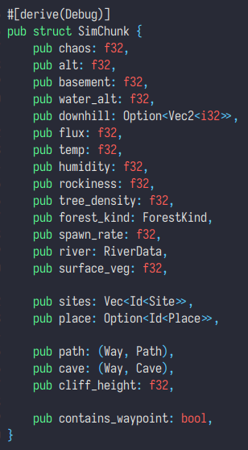

# Worldgen (WIP)

(this document is constructed from interview with zesterer#3131)

- Geological stage
- Filling stage
- Reshaping stage

## Geological stage

* Using noises "generate" properties like altitude, rock strength, humidity, temperature (...) which are used as inputs. *
* Run erosion algorithm basing on inputs generated by noises. **
* Produced output is an altitude map with a few other simple attributes like humidity (but not much else). ***

(It is saved as `.bin` file in the game's assets)

> \* Noises can be imagined as random texture. You can see an example of translating noise levels straight into heightmap here [click here to open an image](https://image.pngaaa.com/789/3711789-middle.png)
>
> \*\* You can see a nice simple example of erosion algorithm here (you can skip to 3:52) [click here to open youtube video](https://youtu.be/eaXk97ujbPQ?t=232)
>
> \*\*\* You can imagine altitude map as bare map with only "shape" - river valleys, basins, mountain ridges etc.

## Filling stage

(Happens when you actually run singleplayer/server)

Using data from Geological stage places lakes and rivers.

Compute tree density, desert dunes...

(e.g. Using "shape" and some metadata it is figuring out if some hole in the ground should be filled with liquid)

The output looks like this:

 
(at this stage, contains_waypoint, path, cave, sites and place are empty)

## Reshaping stage
| *local, temporary, natural elements*

(Exact quote from *zesterer* is pretty self-explainatory:) 
So these are things like cliffs and caves 
We layer these on top of the world using a variety of techniques 
Exactly how isn't too important 
Caves and paths are actually done using the same system, known as the "way" system 
It basically just provides a method of connecting up long elements between chunks
