# CHARACTER CREATION

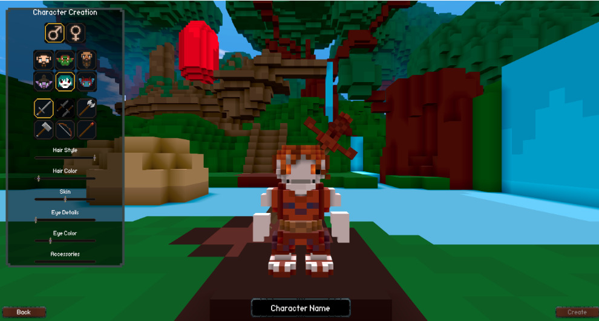

Welcome to the character creation screen! Currently only aesthetic choices are shown; eventually this interface will be expanded to contain lore on each species, guidance on chosen weapons, and starting stats of each species.

There are currently six playable species in Veloren; Human, Orc, Dwarf, Elf, Undead, and Danari. The Danari are the only species you won’t be familiar with; they’re a special species created for the game.

Each species has slightly different starting stats. At this point in the game these have negligible effect on playstyle and can be ignored - they’re not even displayed in the Character Creation screen. The size differences between the species have no bearing on how they play in-game and is just an aesthetic difference.

As well as choosing your species, here you choose your starting weapon. Daggers are still being implemented, and so their icon is greyed out and un-selectable. There are no species restrictions on weapons, and choosing your starter weapon does not lock you into that choice; as you play you’ll find weapons of the other types and can switch to those with no penalty.

You can set your hair style and colour, skin colour, eye details, eye colour, and - only available to some species - accessories.

When you’ve finished creating your character, enter a name, and then click Create. Choose your character from the list, click Enter World, and you’ll enter the game world.

# GETTING STARTED

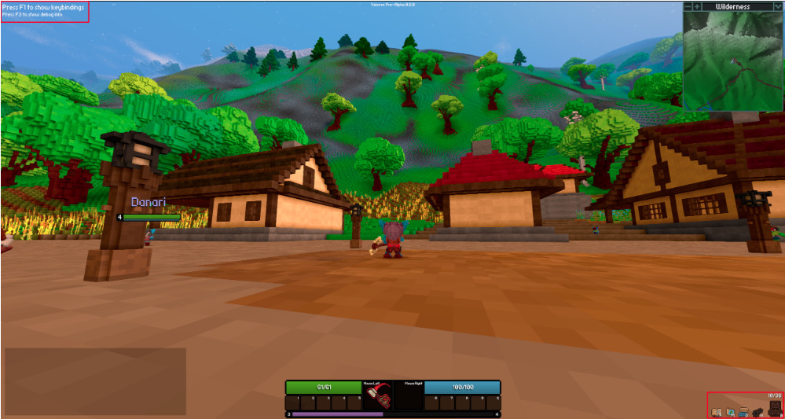

You’ll enter the world in a little village nestled at the foot of a mountain. This is the default world and will be the same for every character you make. This is a pre-generated world; it is possible to generate your own world with a new seed, but this process takes a long time, and so this current world has been pre-generated for your convenience.

Look around your interface. At the top left you’ll see that you can press F1 to show keybinds; have a look at this. On the bottom right, you’ll see a few icons and their corresponding keybinds.

- P - Opens spells (not currently implemented)
- M - Opens the map (this isn’t the final map; the map system is being reworked)
- O - Opens your social tab
- N - Opens your settings
- B - Opens your bag / inventory

You’ll notice NPCs and animals wandering around town. Currently nothing on the surface of the world is hostile; the only hostile enemies you’ll encounter are in the dungeons (more on that later). There are also currently no guards; if you attack an NPC they will cry for help, but otherwise there are no consequences and you can kill them (meanie).

# MANAGING YOUR INVENTORY

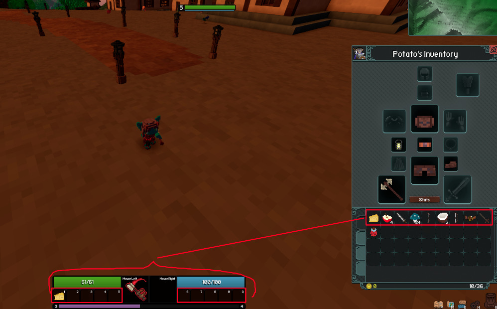

The first nine slots of your bag space, across the topmost row, correspond to slots 1 - 9 in your hotbar. If you drag something from slot 1 of your bag to slot 1 of your hotbar, it binds that slot in your bag to slot 1 of the hotbar. Right now I’ve moved my cheese there, but if I run out of cheese and move an apple into that first slot in my bag, slot 1 of my hotbar will change to the apple. If I run out of cheese and meanwhile loot a weapon that falls into slot 1 of my bag, I’ll see that weapon in slot 1 of my hotbar.

# GEAR

All gear in the game is currently aesthetic only; there are no stats. The weapons have slightly different base stats, and there is one weapon sometimes dropped by the cultist leaders at the bottoms of dungeons that has slightly better stats than all other weapons in the game, but otherwise which weapon you choose will come down to your preferred playstyle, and the gear you equip will be a matter of how stylish you want to look ;)

# WEAPONS AND COMBAT

The weapons and combat systems are still very *very* early in development, are currently not fully implemented, and are being discussed constantly in the Discord with regard to how they’ll work. What you see in-game currently is subject to great change, and should not be considered the final implementation of a system.

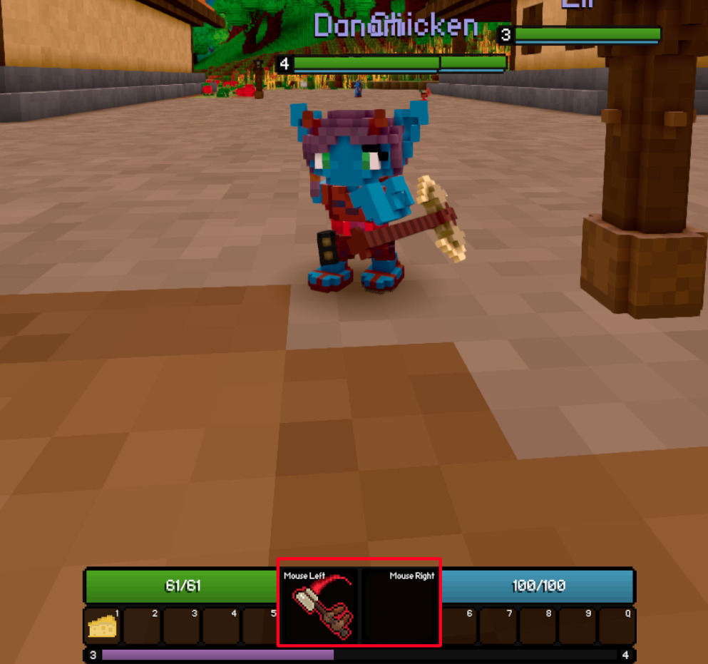

Each weapon has a left- and right- mouse button attack. The mouse-left attack can be considered a ‘light’ attack, while the mouse-right attack is heavier and consumes stamina. Some weapons, such as the axe I’m currently wielding in the screenshot above, don’t show an icon for the mouse-right attack, but do still have one.

Each weapon has its own ‘style’. The sword attacks are very mobile, whereas the hammer is stationary. Ranged requires good aim, and the magical attacks can do things like destroy blocks. The slower weapons have a couple of points higher base damage, while the faster weapons have slightly lower base stats but hit more often. Most creatures in the game are stationary when attacking, but you will find more mobile enemies in the dungeons and might want to switch to a different weapon to deal with those.

# CHARACTER PROGRESSION

Currently the only thing that changes when you level up is that you’ll get a few more health points. This can be difficult to notice as by default your health and stamina bars don’t show numbers; you can change this in the Interface tab of the Settings-
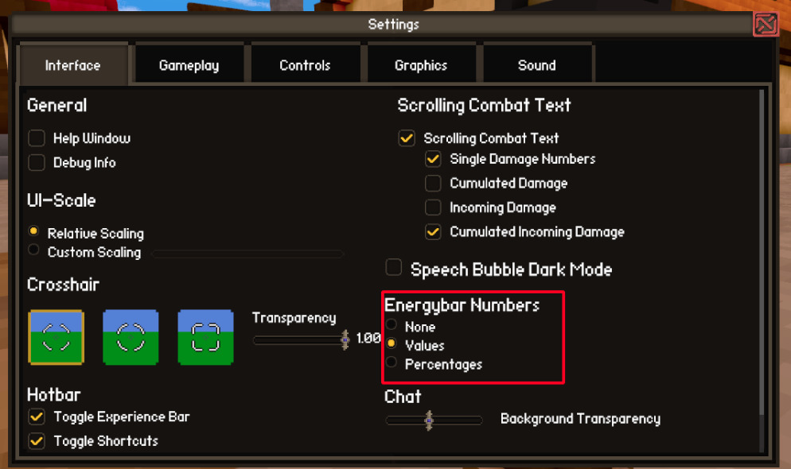

Considering this, if you want to advance to beating the more difficult creatures in the game, currently the only way to make yourself more powerful is to level up a whole bunch!

# ENEMIES

There are two kinds of creature in the game right now; normal-sized creatures that only go as high as level 8, and ‘giant’ creatures whose levels begin around level 30. There’s a big gap there, and to cross it you may have to do some grinding of the lower level mobs.

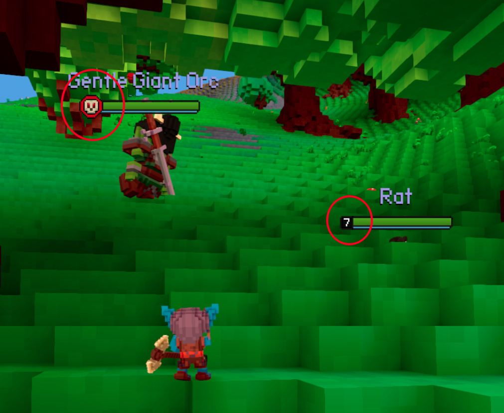

Whether you’re able to see the level of a creature depends on your own level; anything significantly above you in level will show as a skull icon. Creatures close to your level will have their level number visible; if they’re white they’re considered a fair challenge, and if red, maybe a little too high.

When you kill a creature, it will drop a sack of loot. Pick up this sack by hovering over it and pressing the E key.

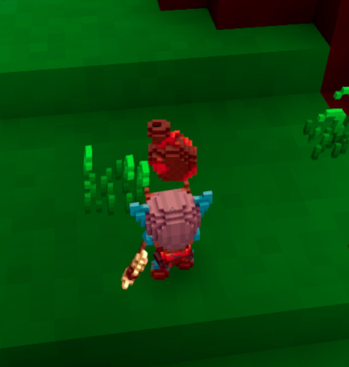

Currently there is no indication of what loot you received, but that’s also something that’s being worked on.

# TAMING

If you’re lucky, something you kill or a chest you loot will drop a Collar. These are special items that let you tame creatures; any creatures, of any level. If you’re a level 1 character and manage to find a Collar, you can use it to tame a skull-level Gentle Giant. :D

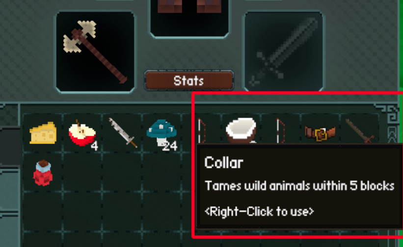

Tamed creatures will follow you around (though be careful as they sometimes get stuck behind objects) and will attack anything that attacks you. 

Friendly fire is currently a thing. If you’ve tamed a creature, make sure that during combat you position yourself such that there’s less risk of you hitting your pet and less risk of it hitting you. This is particularly important with the giants as their attacks pack a punch!

There’s currently no way of healing your pets (there is a Rod of Regeneration in-game which is supposed to heal allies, but isn’t currently working), but letting them do most of the fighting will give them XP and eventually they’ll level up, which will restore their health to max.

Due to aforementioned pathfinding issues, it’s difficult getting pets to go down into dungeons with you, and even more difficult getting them back out again - something to keep in mind.

# MOUNTS

Being able to mount your tamed creatures is a planned feature, but currently not available.

# CAMPFIRES

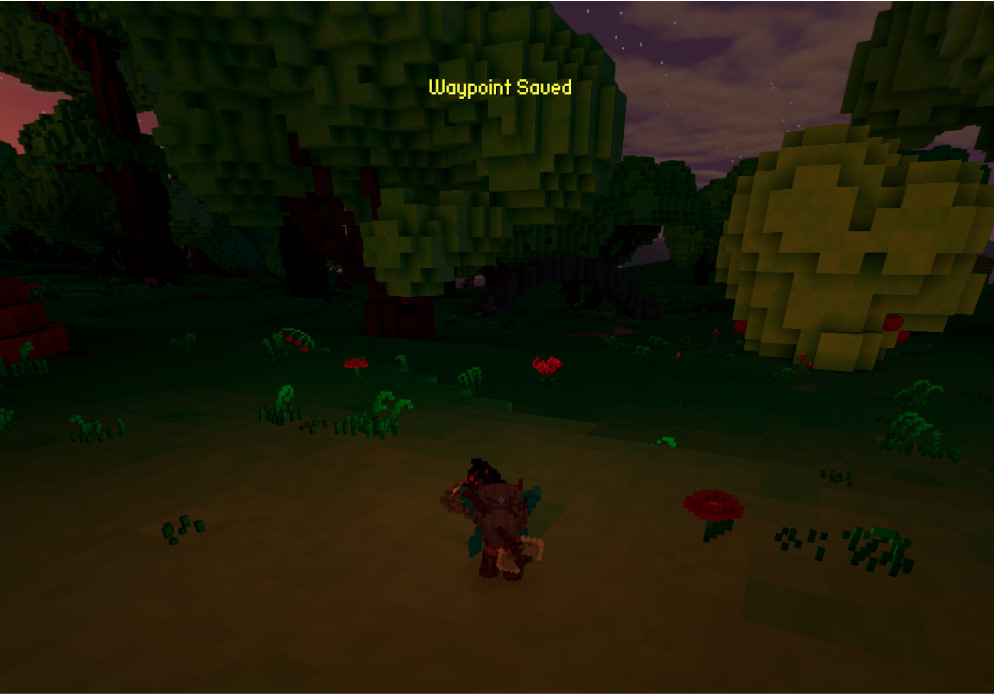

Approaching a campfire will show the message ‘Waypoint Saved’. When you die, you will respawn at the last campfire that saved your waypoint. This currently does not extend to storing your in-game position when you log out; you’ll always log on at the first starting town.

# CHESTS

Chests can be found nestled in tree branches, on the very tops of trees, and inside houses. Keep your eyes peeled!

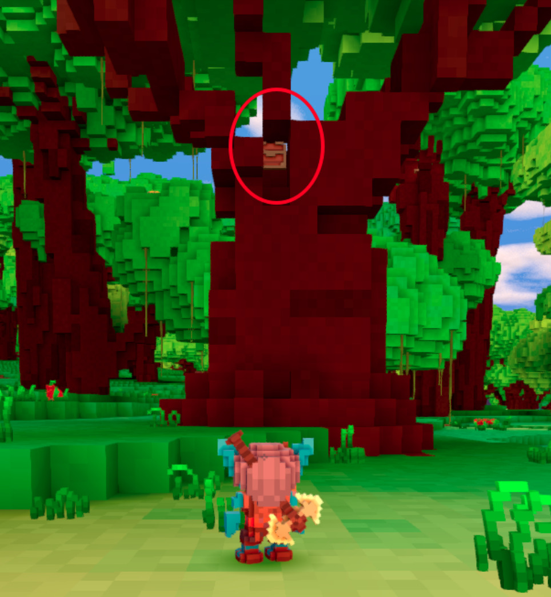

#FINDING FOOD

While killing creatures and looting chests can sometimes give you food and potions, you can also forage for food in the wild by picking apples and mushrooms.

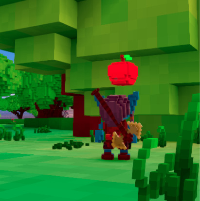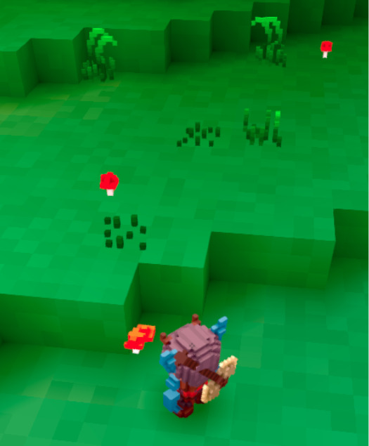

Gather-able items will highlight when you move your reticle over them. This can be a little difficult with the smaller mushrooms as the reticle is quite tiny!

# GLIDING

The gliding system is still being developed. Until recently it was possible to open the glider mid-air, but his has been changed in favour of a toggle system that keeps the danger of fall damage a reasonable threat.

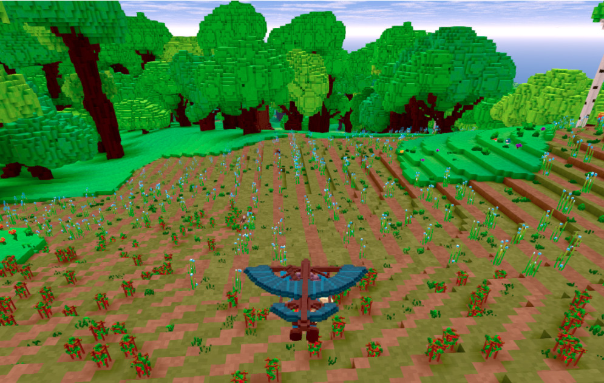

Pressing the Shift key will equip the glider. You can run around with it equipped, but won’t be able to do anything else like draw your weapon (and if you have your weapon drawn, you won’t be able to equip the glider).

When gliding, holding the W key will maintain altitude, and letting go of the W key will make you slowly descend.

# DUNGEONS

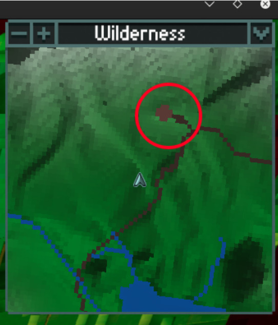

Towns and dungeons are marked on your map with brown circles. Look out for them while traveling!

Dungeon entrances are all uniquely themed, and usually (always?) have a campfire somewhere nearby, either just outside, or sometimes just inside the entrance.

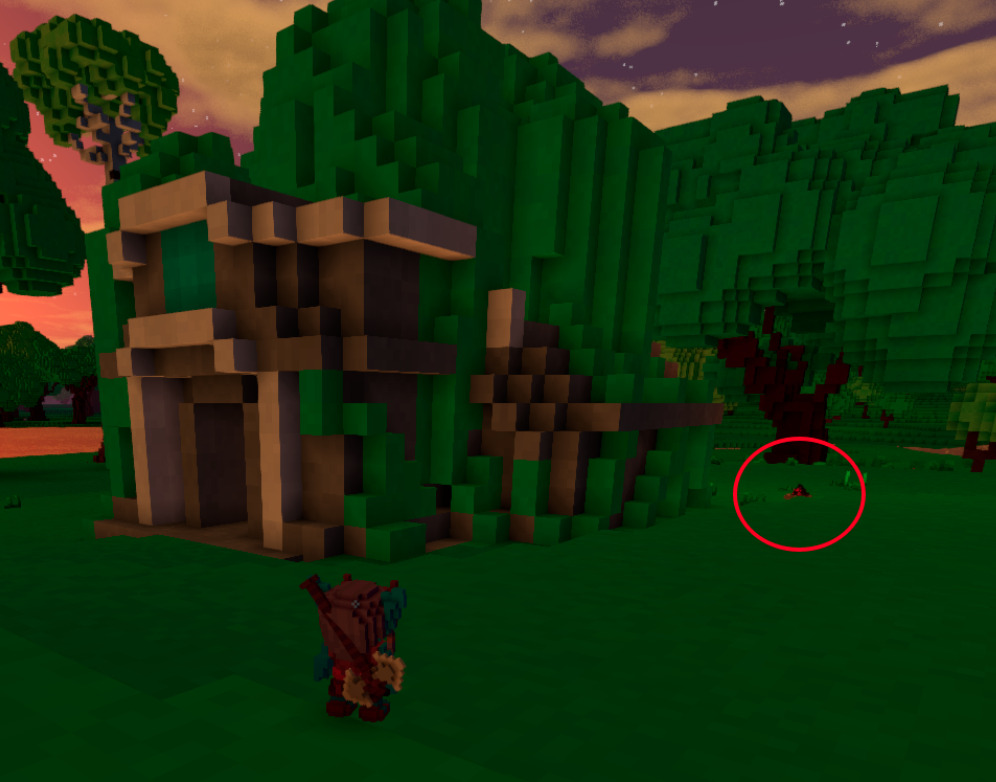

On entering the dungeon you’ll descend a long, spiral staircase that will eventually exit at the first dungeon level, deep below ground. Each level has a series of corridors and rooms containing hostile enemies (both small and giant), treasure chests, and scattered mushrooms and something called Velorite. Velorite is a consumable item that grants XP on use.

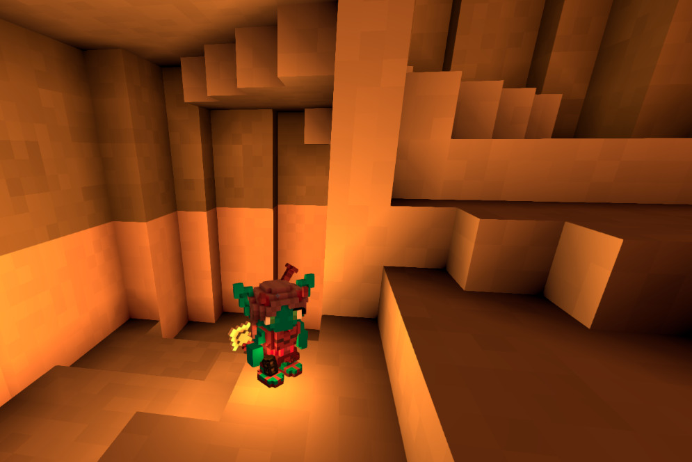

Dungeons are dark - equip your lantern by pressing the G key!

On every level there’ll be a room with a staircase leading down to the next level. There are several levels to traverse before you’ll find the last level with the Cultist Leader, the dungeon boss.

It’s currently possible to clip the camera through the side wall, allowing you to see the floors below you, and sometimes a glimpse at what they contain;

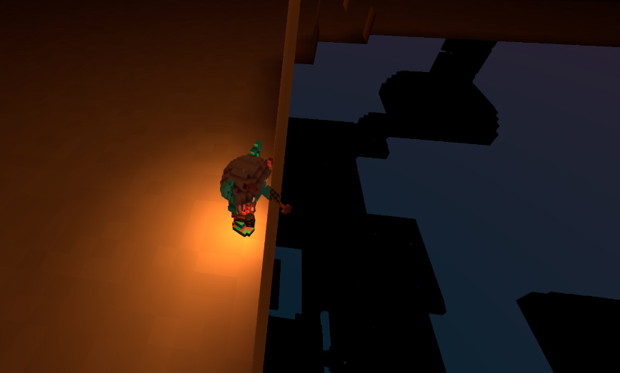

Make sure you’re well stocked up on food and have some levels under your belt before attempting your first dungeon!
