# Character Creation

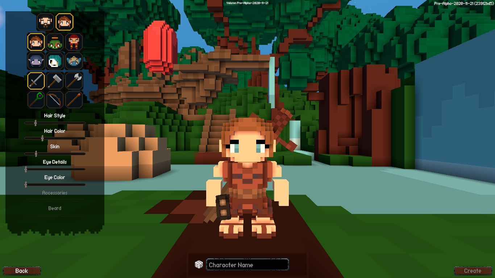

Welcome to the character creation screen! Currently only aesthetic choices are shown; eventually this interface will be expanded to contain lore on each species, guidance on chosen weapons, and starting stats of each species.

There are currently six playable species in Veloren; Human, Orc, Dwarf, Elf, Undead, and Danari. The Danari are the only species you won’t be familiar with; they’re a special species created for the game.

Each species has slightly different starting stats. At this point in the game these have negligible effect on playstyle and can be ignored - they’re not even displayed in the Character Creation screen. The size differences between the species have no bearing on how they play in-game and is just an aesthetic difference.

As well as choosing your species, here you choose your starting weapon. Daggers are still being implemented, and so their icon is greyed out and un-selectable. There are no species restrictions on weapons, and choosing your starter weapon does not lock you into that choice; as you play you’ll find weapons of the other types and can switch to those with no penalty.

You can set your hair style and colour, skin colour, eye details, eye colour, and - only available to some species - accessories.

When you’ve finished creating your character, enter a name, and then click Create. Choose your character from the list, click Enter World, and you’ll enter the game world.

# Getting Started

You’ll enter the world in a little village nestled at the foot of a mountain. This is the default world and will be the same for every character you make. This is a pre-generated world; it is possible to generate your own world with a new seed, but this process takes a long time, and so this current world has been pre-generated for your convenience.

Look around your interface. At the top left you’ll see that you can press F1 to show keybinds; have a look at this. On the bottom right, you’ll see a few icons and their corresponding keybinds.

- P - Opens spells (not currently implemented)
- M - Opens the map (this isn’t the final map; the map system is being reworked)
- O - Opens your social tab
- N - Opens your settings
- B - Opens your bag / inventory

You’ll notice NPCs and animals wandering around town. In general, predatory animals and monsters will attack the player on sight, while docile creatures and NPCs will ignore the player until attacked. Observe carefully and you may notice wildlife interacting with each other. A player might even be able to score easy loot this way!

There are also currently no guards; if you attack an NPC they will cry for help and will attack you in return, but otherwise there are no consequences and you can kill them (meanie). 

# Managing Your Inventory

The first nine slots of your bag space, across the topmost row, correspond to slots 1 - 9 in your hotbar. If you drag something from slot 1 of your bag to slot 1 of your hotbar, it binds that slot in your bag to slot 1 of the hotbar. Right now I’ve moved my cheese there, but if I run out of cheese and move an apple into that first slot in my bag, slot 1 of my hotbar will change to the apple. If I run out of cheese and meanwhile loot a weapon that falls into slot 1 of my bag, I’ll see that weapon in slot 1 of my hotbar.

# Looting and Gathering

If you look carefully you may notice certain objects in the world will highlight when you move your crosshair over them. This indicates you can interact with them ("E" by default), which will give you an item. Chests will give random loot, and objects will give a food or crafting item.

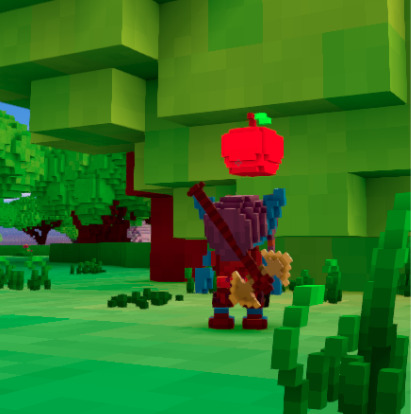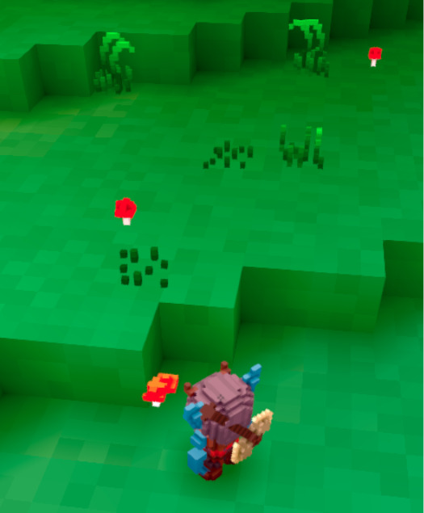

Try switching to first person view by scrolling all the way in (or pressing "0") to make gathering easier.

# Gear

Gear can be crafted or looted from fallen enemies and chests. Currently, the only stats associated with gear are "power" and "armor" values. Higher power gives a weapon more damage. Higher armor on worn gear gives damage reduction scaled to your total armor. Gear is the fastest and easiest method of progressing, so get started early!

# Crafting

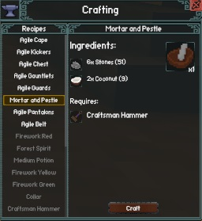

You can open the crafting menu with "C". Items can be crafted with gatherable materials such as Twigs, which can be picked up off the ground, and other materials that may drop from enemies. Food items can be crafted into even more effective foods, and some weapons and armor can also be crafted.

The fireworks are for celebratory use only; ignite responsibly.

A note on Velorite: Velorite is an item that either gives XP (when used) or can be used in crafting. Currently, Velorite (and Velorite fragments) is an extremely rare resource that is only obtained from a specific enemy. The balance of consumables and loot tables is always under evaluation, so this will probably change.

# Weapons And Combat

The weapons and combat systems are still very *very* early in development, are currently not fully implemented, and are being discussed constantly in the Discord with regard to how they’ll work. What you see in-game currently is subject to great change, and should not be considered the final implementation of a system.

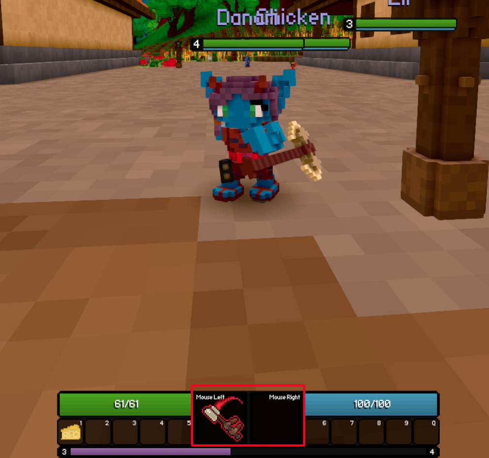

Each weapon has a left- and right- mouse button attack. The mouse-left attack can be considered a ‘light’ attack, while the mouse-right attack is heavier and usually consumes stamina. Some weapons, namely staves, have a second ability activated by pressing "1" in the hotbar. The ability will replace whatever item is in that hotbar slot when you equip the weapon. 

Each weapon has its own 'style'. The sword attacks are very mobile, whereas the hammer is stationary. Ranged requires good aim, and the magical attacks can do things like destroy blocks. The slower weapons have a couple of points higher base damage, while the faster weapons have slightly lower base stats but hit more often. Most creatures in the game are stationary when attacking, but you will find more mobile enemies in the dungeons and might want to switch to a different weapon to deal with those.

**Note**: *The entire weapon system is undergoing an overhaul. What is described above is accurate to the system at the time of writing. Expect combat to change as time goes on.*

# Character Progression

Currently the only thing that changes when you level up is that you’ll get a few more health points. If the health and stamina bars aren't showing numbers, you can change this in the Interface tab of the Settings.

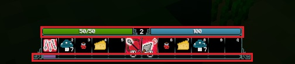

The main way to progress currently is through gear. Thus, it is recommended to loot everything you find, since you never know when you might come across better gear!

# Enemies

There are two kinds of creature in the game right now; normal-sized creatures that only go as high as around level 10, and ‘giant’ creatures whose levels begin around level 30. There’s a big gap there, and to cross it you may have to do some grinding of the lower level mobs.

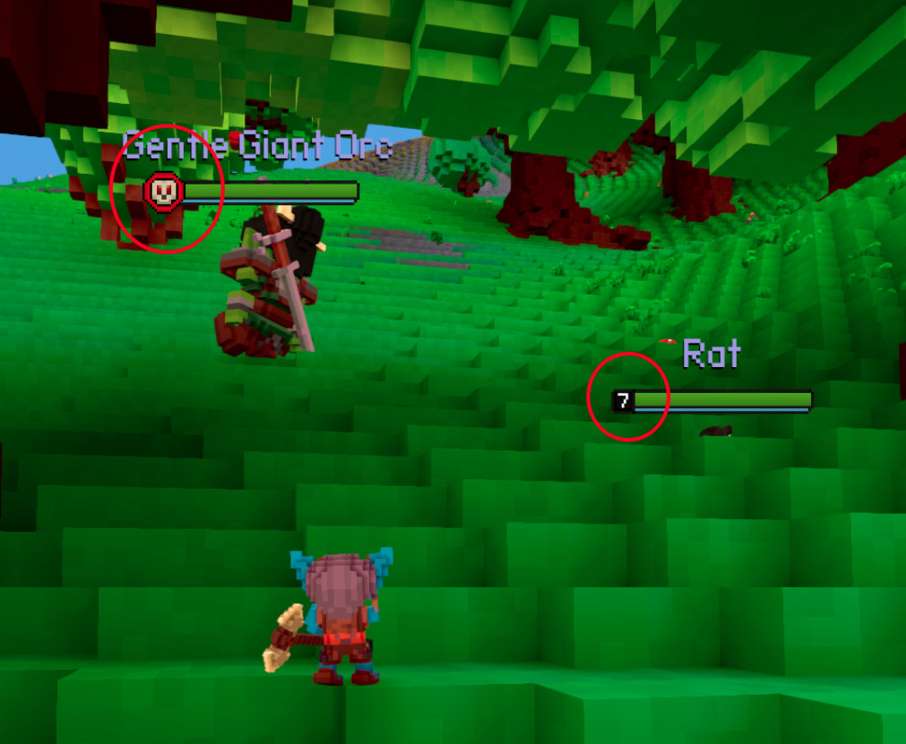

Whether you’re able to see the level of a creature depends on your own level; anything significantly above you in level will show as a skull icon. Creatures close to your level will have their level number visible; if they’re white they’re considered a fair challenge, and if red, maybe a little too high.

When you kill a creature, it will drop a sack of loot. Pick up this sack by hovering over it and pressing the E key.

When you loot an item, either from a chest or a lootsack or from harvesting, you'll see a notice in your chat log telling you what you've picked up.

# Taming

If you’re lucky, something you kill or a chest you loot will drop a Shiny Gem, or even more rarely a Collar. Shiny Gems are special items that, when crafted into a Collar, let you tame creatures, and the current maximum number of creatures you can have tamed at once is three. You can only tame non-hostile normal-sized creatures. Choose carefully!

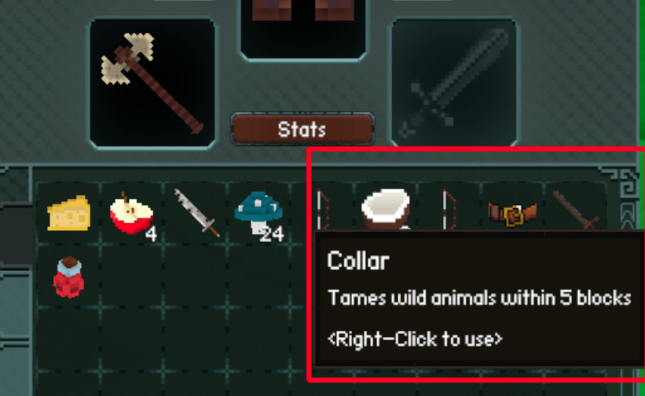

Tamed creatures will follow you around (though be careful as they sometimes get stuck behind objects) and will attack anything that attacks you.

You can heal your pets with the Sceptre of Regeneration, but it is currently bugged and undergoing an overhaul.

Due to pathfinding issues, it’s difficult getting pets to go down into dungeons with you, and even more difficult getting them back out again - something to keep in mind.

Currently, pets do not persist through logins. Don't get too attached.

# Mounts

Being able to mount your tamed creatures is a planned feature, but currently not available.

# Campfires

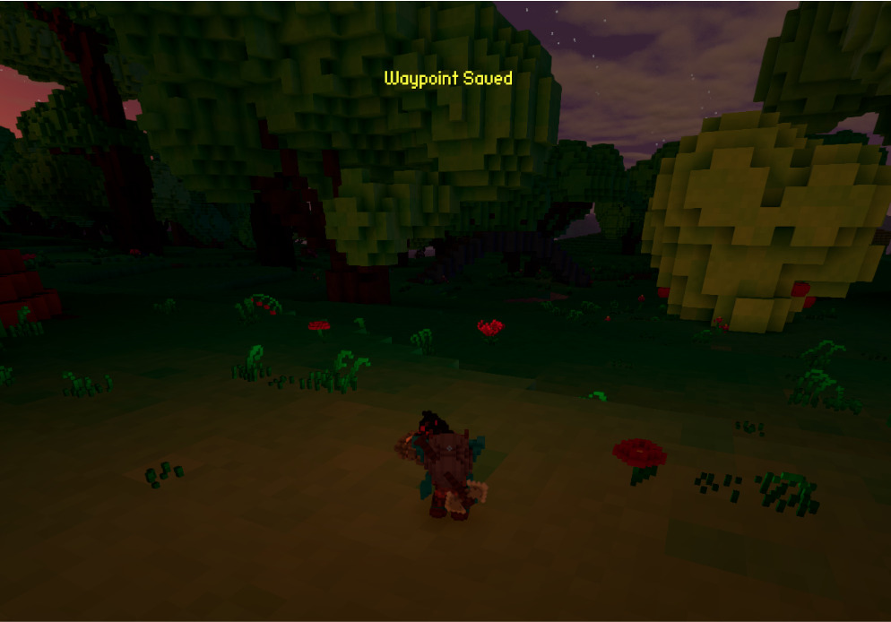

Approaching a campfire will show the message ‘Waypoint Saved’. When you die, you will respawn at the last campfire that saved your waypoint. This currently does not extend to storing your in-game position when you log out; you’ll always log on at the first starting town.

# Chests

Chests can be found nestled in tree branches, on the very tops of trees, and inside houses. Keep your eyes peeled!

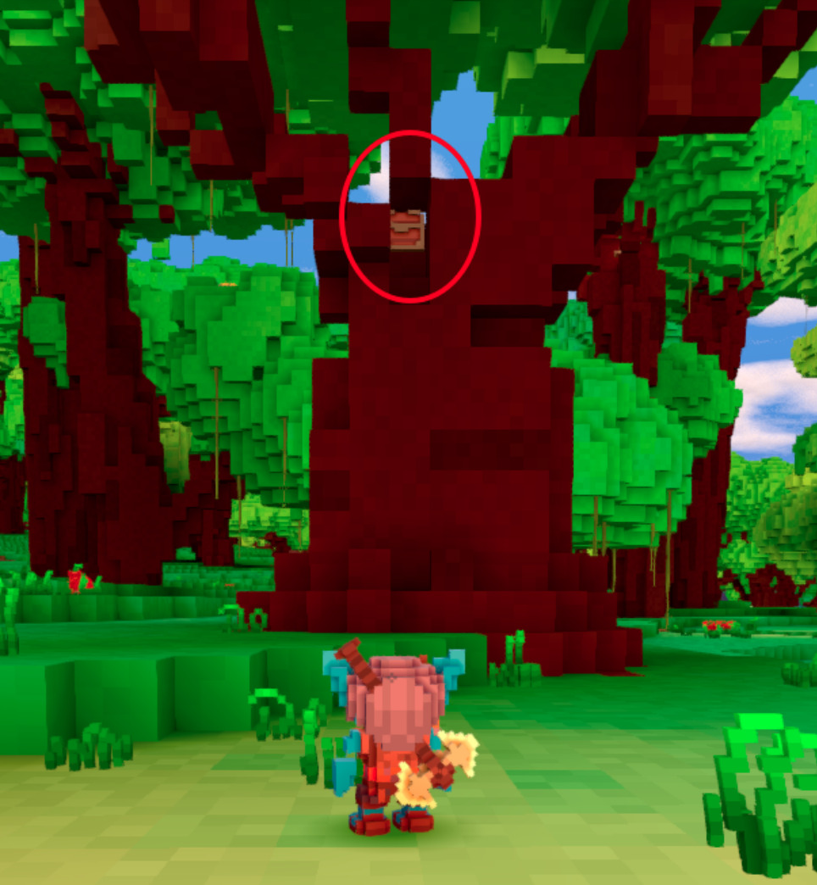

# Gliding

The gliding system is still being developed. Until recently it was possible to open the glider mid-air, but his has been changed in favour of a toggle system that keeps the danger of fall damage a reasonable threat.

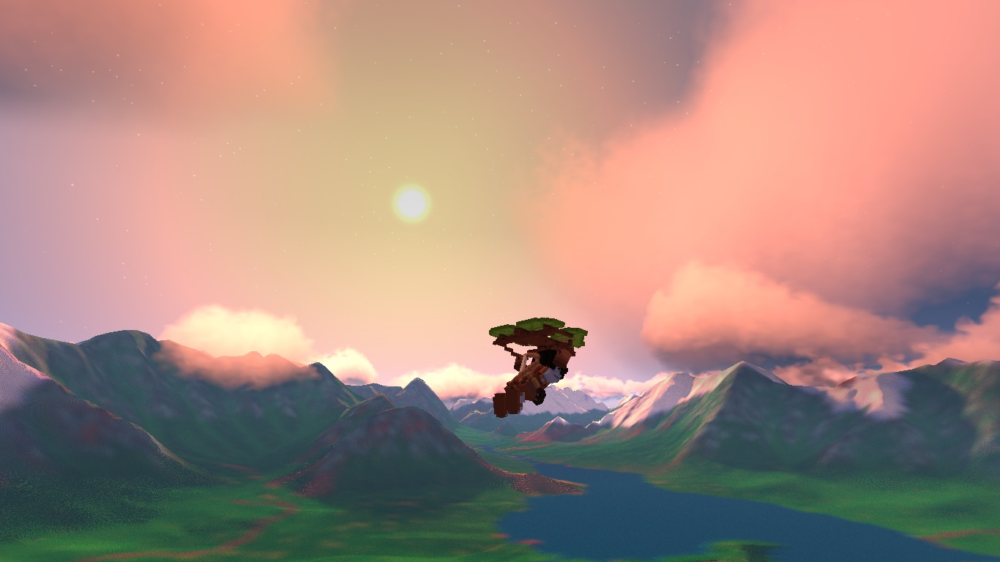

Pressing the Shift key will equip the glider. You can run around with it equipped, but you won’t be able to roll or draw your weapon at the same time.

When gliding, holding the W key will maintain altitude, and letting go of the W key will make you slowly descend.

# Dungeons

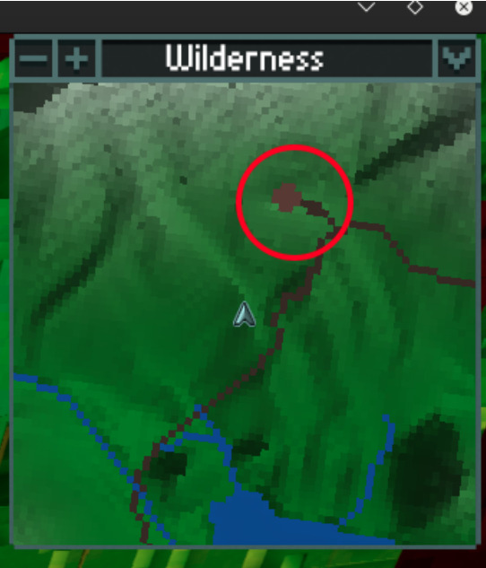

Towns and dungeons are marked on your map with brown circles. Look out for them while traveling!

Dungeon entrances are all uniquely themed, and usually have a campfire somewhere nearby, either just outside, or sometimes just inside the entrance.

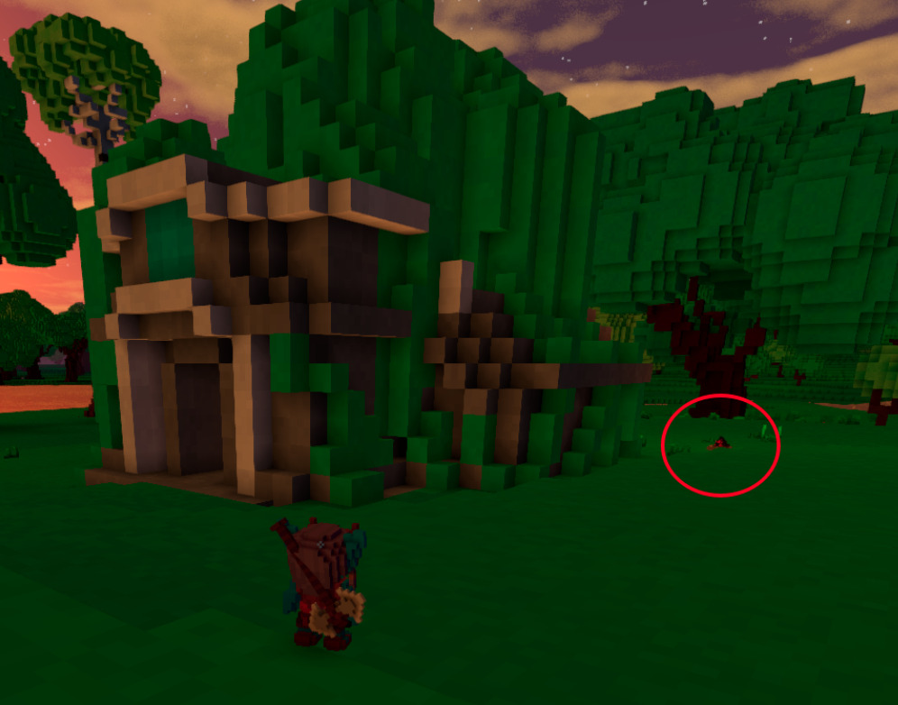

On entering the dungeon you’ll descend a long, spiral staircase that will eventually exit at the first dungeon level, deep below ground. Each level has a series of corridors and rooms containing hostile enemies (both small and giant) and treasure chests. The most rare and powerful loot in the game can be obtained from dungeons!

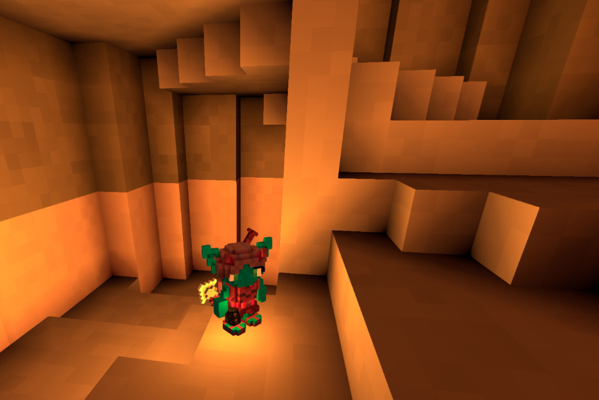

Dungeons are dark - equip your lantern by pressing the G key!

On every level there’ll be a room with a staircase leading down to the next level. There may also be a campfire at the top of each staircase. There are several levels to traverse before you’ll find the last level with the Cultist Leader, the dungeon boss.

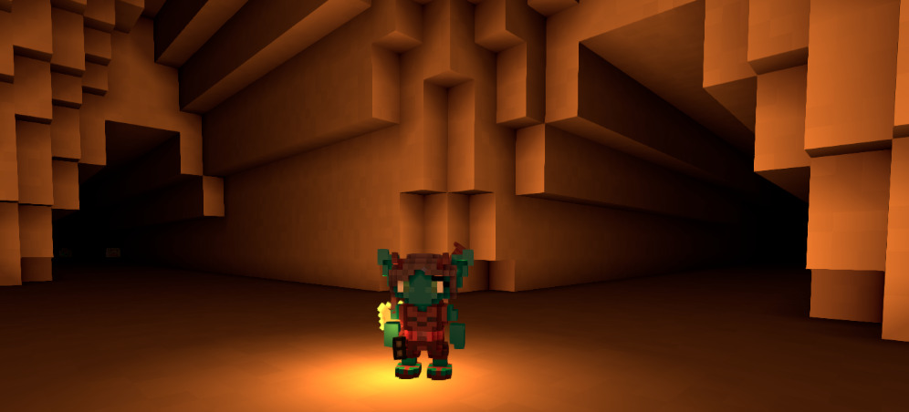

Make sure you’re well stocked up on food and have some levels under your belt before attempting your first dungeon!
