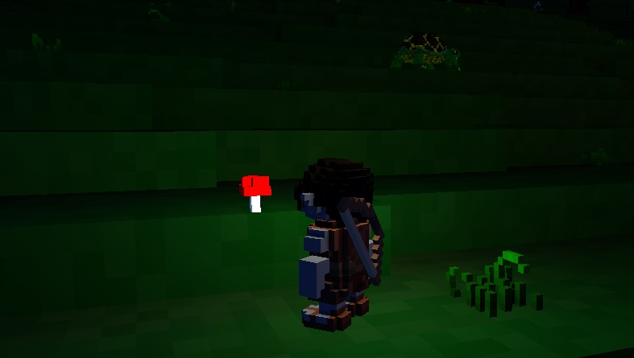
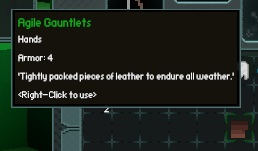
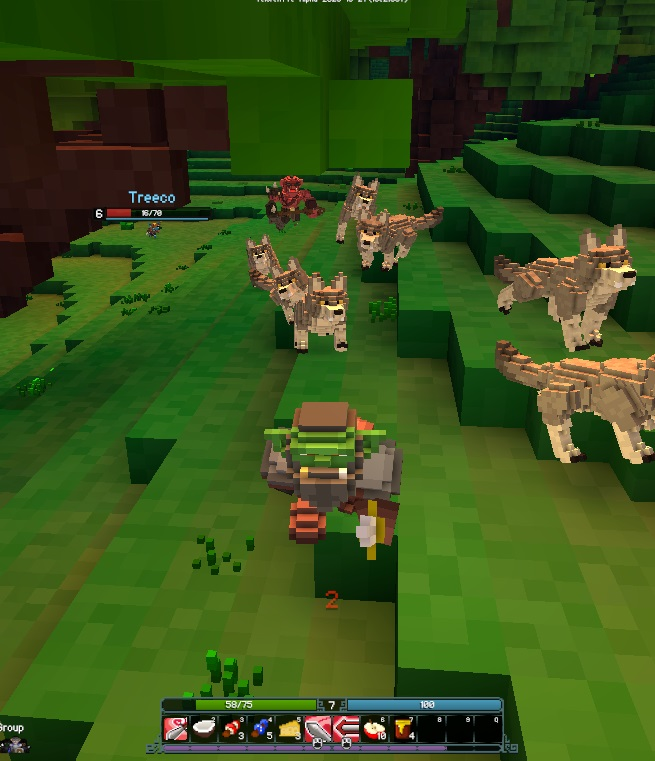
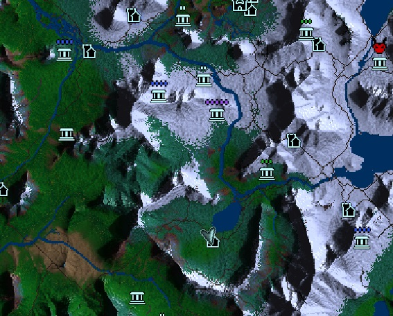
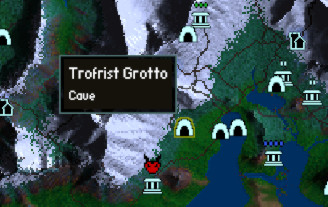
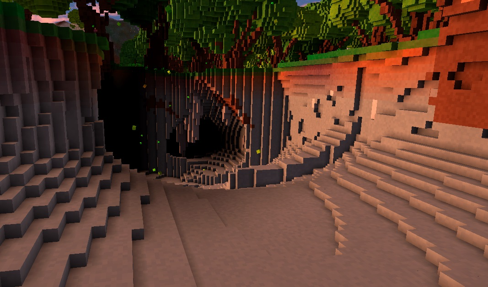
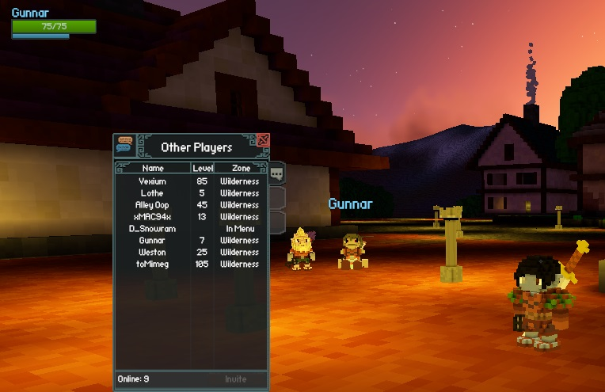

*If you are planning on playing multiplayer, make sure you register at [account.veloren.net](https://account.veloren.net/) before connecting to an auth-enabled server. Otherwise, things remain mostly the same for both singleplayer and multiplayer. Keep in mind that every aspect of the game is subject to change, and this guide may not be 100% up to date when you read it.*

# Character Creation

Welcome to the character creation screen! Currently only aesthetic choices are shown; eventually this interface will be expanded to contain lore on each species, guidance on chosen weapons, and starting stats of each species. As of now, however, your choice of species matters little.

There are currently six playable species in Veloren; Human, Orc, Dwarf, Elf, Undead, and Danari. The Danari are the only species you won’t be familiar with; they’re a special species created for the game.

As well as choosing your species, here you choose your starting weapon. There are no species restrictions on weapons, and choosing your starter weapon does not lock you into that choice; as you play you’ll find weapons of the other types and can switch to those with no penalty.

You can set your hair style and colour, skin colour, eye details, eye colour, and - only available to some species - accessories. Use the randomize button (the dice icon) to randomize your character's appearance and name.

When you’ve finished creating your character, enter a name, and then click Create. Choose your character from the list, click Enter World, and you’ll enter the game world.

# Getting Started

You’ll enter the world in a little village nestled at the foot of a mountain. This is the default world and will be the same for every character you make. This is a pre-generated world; it is possible to generate your own world with a new seed, but this process takes a long time, and so this current world has been pre-generated for your convenience.

Look around your interface. At the top left you’ll see that you can press F1 to show keybinds; have a look at this. On the bottom right, you’ll see a few icons and their corresponding keybinds.

- P - Opens spells (not currently implemented)
- M - Opens the map (this isn’t the final map; the map system is being reworked)
- O - Opens your social tab
- N - Opens your settings
- B - Opens your bag / inventory
- C - Opens the crafting menu

You can change most key bindings in the settings.

# Managing Your Inventory

Inventory slots can be assigned to hotbar slots by clicking and dragging the item stored in the slot to the hotbar. Any items in that inventory slot will then appear in the assigned hotbar slot. Hotbar slots can be reassigned by dragging an item in a different inventory slot to it. Here, 7 will use the cheese, but if I run out of cheese and another item takes its slot in the inventory, for example, 7 will use that item instead.

*Depending on your equipped weapon, some hotbar slots will be reserved for abilities.*

If your inventory is getting cluttered or full, you can rearrange the items by dragging them around, or throw them away by dragging them outside the inventory window.

# Looting and Gathering

If you look carefully you may notice certain objects in the world will highlight when you move your crosshair near them. This indicates you can interact with them (E by default), which will usually give you an item.

# Gear

Gear can be crafted from materials or looted from enemies and chests. It comes in several rarities. Gear is one of the main ways to progress in the game, so get started early!

# Consumables

Consumables currently come in two varieties: food and potions. Food affects you at a certain rate for its duration while potions take effect instantaneously.

# Crafting

You can open the crafting menu with the C key. You'll see a list of craftable items, some of which may be greyed out - that means you have insufficient materials or tools to craft them. Items can be crafted with materials either gathered from the world or dropped by enemies. Food items can be crafted into even more effective foods, and some basic weapons and armor can also be crafted.

*The fireworks are for celebratory use only. Ignite responsibly.*

# Weapons And Combat

As you wander the world of Veloren, you'll encounter all manner of animals, monsters, NPCs, and maybe even players. In general, predatory animals and monsters will attack the player on sight, while docile creatures and NPCs will ignore the player unless attacked.

Each weapon has a left-click basic attack and one or more abilites on right click and the hotbar. Each weapon has its own playstyle, and serve to replace conventional 'classes.' 

Using more than one weapon by equipping it to the 'offhand' will increase your combat options immensely! Switch to your offhand weapon by pressing Tab.

Dodging enemy attacks is important. Middle-click will swiftly roll you out of the way.

# Character Progression

Defeating enemies earns you experience, which allows you to level up your character.

Currently the only thing that changes when you level up is that you’ll get a few more health points. In the future, skill trees will be implemented to give more weight to leveling up. Otherwise, obtaining better gear is essential to progression.

# Taming

In the course of playing the game, you'll be able to craft Collars, which let you tame creatures. The current maximum number of creatures you can have tamed at once is three. You can only tame non-hostile creatures. Choose carefully!

Tamed creatures will follow you around and will attack anything that attacks you. They can be healed with a healing sceptre. 

Due to pathfinding issues, pets may have difficulty keeping up with you when you go off gliding or delve into dungeons.

*Currently, pets do not persist through logins. Don't get too attached.*

# Campfires

Campfires are interspersed across the world, marked by tall pillars of smoke. Approaching a campfire will show the message ‘Waypoint Saved’. When you die, you will respawn at the last campfire that saved your waypoint. Your waypoint persists through logins, so you can start each session approximately where you left off!

# Map

Access the map by pressing M. You'll see icons representing dungeons, towns, and cave entrances along with brown lines denoting roads. The difficulty level of a dungeon is represented by the number of dots that appear above the icon. Your current location is initially at the center of the screen, but the map can be shifted around by clicking and dragging. The mouse wheel zooms in and out. There is also a minimap seen in regular play at the top right. 

# Gliding

Pressing the Shift key will equip the glider. You can run around with it equipped, but you won’t be able to roll or draw your weapon at the same time.

When gliding, holding the W key will maintain altitude, and letting go of the W key will make you slowly descend.

*Note that you are not able to re-equip the glider if you retract it early in midair.*

# Dungeons

Dungeons are marked on the map with a 'ruins' icon, along with a difficulty level.

On entering the dungeon you’ll descend a long, spiral staircase that will eventually exit at the first dungeon level, deep below ground. Each level has a series of corridors and rooms containing hostile enemies and treasure chests. The most rare and powerful loot in the game can be obtained from dungeons!

*Dungeons are dark - equip your lantern by pressing the G key!*

Make sure you’re well stocked up on healing items and have some levels under your belt before attempting your first dungeon!

# Caves

Caves are marked with cave entrance icons on the map.

Several resources can be found in caves, some of which are exclusive to them. Are you prepared to plumb the depths, adventurer?

# Grouping Up

When playing in a multiplayer server, you may wish to team up with other players in order to conquer content without losing track of or hurting each other. The grouping function is your friend here. To invite other players to your group, press O to open the player list, click on the character you want to invite, and press Invite. Hovering over the character names will show you the player's account name.

# Useful Commands

`/home` - Teleports you to the default spawn and resets your waypoint.

`/w` - global chat

`/r` - regional chat

`/g` - group chat

`/t` - direct chat